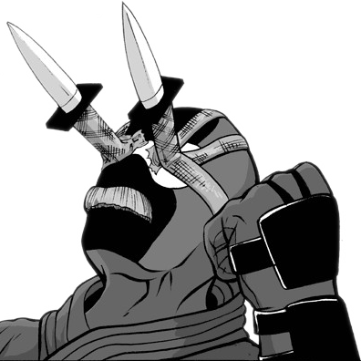

## Me

<small class="portrait">Please don't try this <s>at home</s>.</small>

I like to solve problems with code, and building things to learn new stuff. Most
of my open-source code is written in C++ and JavaScript, but these days I
generally prefer Rust and TypeScript. I don't write enough Python. At work I
mostly write Java.

I've also made or helped make a number of mods for The Elder Scrolls IV:
Oblivion, and written some articles about modding on Oblivion, Skyrim, Fallout 3
and Fallout: New Vegas, some of which can be found here.

*Ortham* is my main pseudonym these days, but I've historically gone by
*WrinklyNinja* within the Elder Scrolls modding community. I got the
latter name from the last line of
[this](https://www.youtube.com/watch?v=V2jDTufS5WY) Orange advert. It's not a
great ad, but for some reason the ending stuck in my head long after I'd
totally forgotten about the rest of it. My avatar is a holdover from that name,
and depicts Dan McNinja, from *The Adventures of Dr. McNinja*. I can't remember
why he has knives taped to his face, but it's a suitably silly image that Chris
Hastings was gracious enough to let me use.

When I'm not writing code, I like to chip away at my backlog of PC games.
I also enjoy travelling and taking way too many pictures on my trips, but I'm
terrible at getting around to organising them, so I don't do it enough.

## This Site

This site is where I put anything that's probably too long to make a post on
Discord or forums, so is mostly related to the software projects I work on in my
free time.

The site is generated using [Hugo](https://gohugo.io/), uses the
[Congo](https://github.com/jpanther/congo) theme, and is hosted on
[GitHub](https://github.com/Ortham/Ortham.github.io). Parts of it also use
[D3](https://d3js.org/) and [Mermaid](https://mermaid.js.org/).

Site content is copyright Oliver Hamlet under the
[CC BY-NC-SA 4.0](https://creativecommons.org/licenses/by-nc-sa/4.0/) license.
