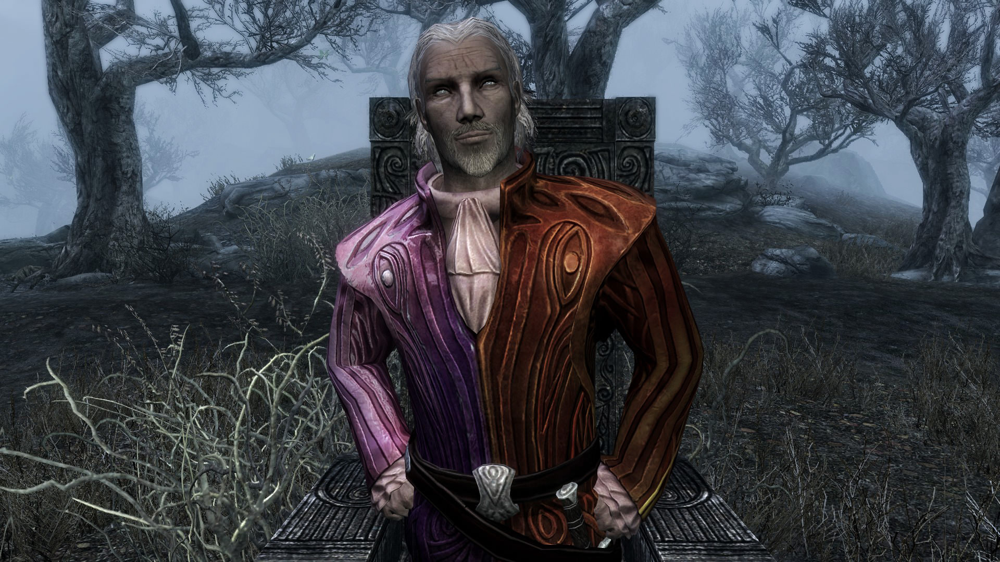
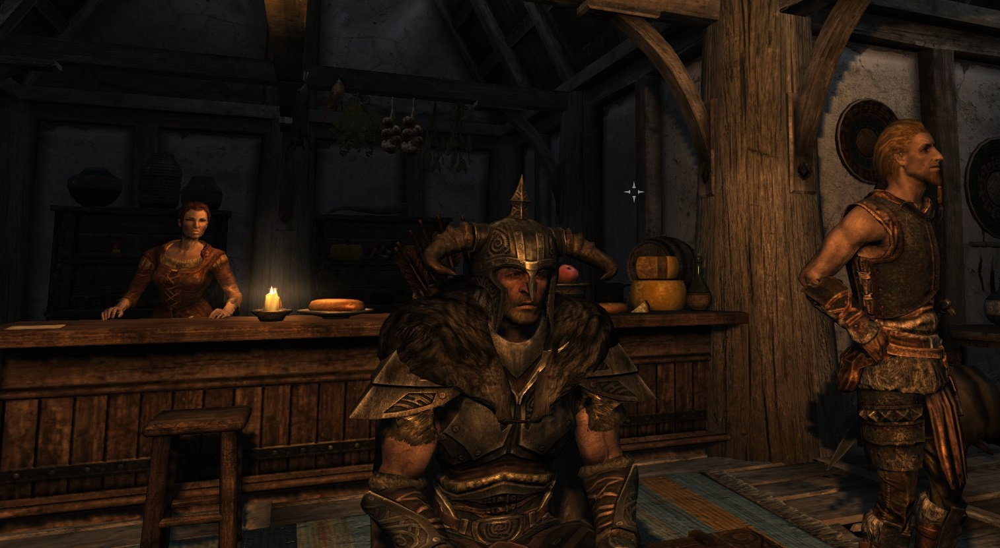
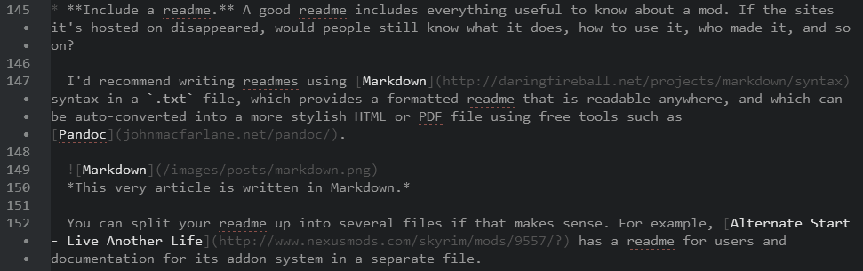

## What Madness Is This?

I've been around long enough to know that modding Skyrim should be done carefully and patiently, with lots of reading, because it's complicated and can blow up in your face fifteen hours into an epic adventure.

The trouble is, a measured approach is frequently not much fun, and everyone would appreciate a simpler system. I know I'd rather spend the time furthering  the <del>Brumbek Conspiracy</del> development of my various projects.

This post is therefore about using mods more like a newbie would, then using my knowledge to check the shortcomings of such an approach. The results should provide useful data on how various parts of the process can be improved to streamline the use of mods, to the benefit of the whole community.

## Teflon Slides Forth!

After almost 153 hours on one character (a Wizard-turned-battlemage), I decided to start over with a warrior, whom I named Teflon the Tall. *Yes, I'm rubbish with names.* I'd previously only used the following mods, which I consider essential to every playthrough.

1. [Unofficial Skyrim Patch](https://www.nexusmods.com/skyrim/mods/19/)
2. [Unofficial Dragonborn Patch](https://www.nexusmods.com/skyrim/mods/31083/)
3. [Skyrim Script Extender](https://skse.silverlock.org)
4. [SkyUI](https://www.nexusmods.com/skyrim/mods/3863/)

These were installed manually, apart from SkyUI, which I installed through the Steam Workshop.

This time, I was going to use mods to change some of the things I'd noticed I didn't like the first time around. My main problem with the gameplay had been that the schools of magic were unbalanced, with special mention going to the useless anti-undead spells, in a game that is crawling with Draugr.

However, Teflon has a particular distate for wizard trickery, so I didn't bother with a magic rebalancing mod. Instead, I'd be focussing on improving those aspects of gameplay that were more universal.

My main beef with the world was that my character was given no reason to *live* in it. The lack of a circadian rhythm was one part: it's always bright and there's no fatigue mechanic, so why bother sleeping? Another was the disconnect between the environment and my actions: I could bunnyhop through a blizzard in my undies to no effect, if I so wished.

So, here are the mods I added.

### The New Essentials

These mods are those I already know that I wouldn't play without (unless something better comes along), after a few hours:

* [Alternate Start - Live Another Life](https://www.nexusmods.com/skyrim/mods/9557/?): While I enjoyed Skyrim's beginning a lot more than Oblivion's, a chance to roleplay something different is welcome, and it gets me into the action faster.
* [Climates of Tamriel](https://www.nexusmods.com/skyrim/mods/17802/?): It gives me darker nights. I've never had a problem with Skyrim's weather though, so this may be overkill.
* [Realistic Lighting Overhaul](https://www.nexusmods.com/skyrim/mods/30450/?): This fixes dungeons to be dark where there are no light sources, which got me hacked to pieces in the dark on my first dungeon crawl. I also like the changes it makes to the lighting in the rest of the game, it feels that much more atmospheric.
  * [Wearable Lanterns](https://www.nexusmods.com/skyrim/mods/17416): After my first death, I bought myself one of these, then went back to the cave. I lasted a few seconds longer...
* [Frostfall - Hypothermia Camping Survival](https://forums.bethsoft.com/topic/1509561-frostfall/): Environmental gameplay mechanics!
  * [Cloaks of Skyrim](https://www.nexusmods.com/skyrim/mods/12092/?): Makes up for the lack of warm clothing in vanilla.
  * [Winter Is Coming - Cloaks](https://www.nexusmods.com/skyrim/mods/13486): Just as good as the above, so why not use both?
* [Lock Overhaul](https://www.nexusmods.com/skyrim/mods/29979/): Adds lock bashing, which is sorely needed by my warrior. I like how all it involves is swinging at the lock until a success sound plays or I get an "it's too tough" message in the corner of my screen. However, script lag makes the experience into cause, pause and effect, and the volume of the success sound makes the preceding action seem too quiet.

### Other Mods

* [Better Dynamic Snow](https://www.nexusmods.com/skyrim/mods/10383/?): I'd noticed it looking rubbish at a few points.
* [W.A.T.E.R. - Water and Terrain Enhancement Redux](https://www.nexusmods.com/skyrim/mods/13268/?): The water looks better, but I don't think there's much wrong with vanilla water.
* [Wet and Cold - Holidays](https://www.nexusmods.com/skyrim/mods/51472/): A wonderful little mod, adds a little vibrancy and cheer to the game. It requires [Wet and Cold](https://www.nexusmods.com/skyrim/mods/27563/?), which I'm not really interested in, and for consistency I also use [Wet and Cold - Ashes](https://www.nexusmods.com/skyrim/mods/31968/?).
* [Run For Your Lives](https://www.nexusmods.com/skyrim/mods/23906/?): The appropriate response when meeting a dragon is, after all, to run screaming.
* [Open Faced Guard Helmets](https://skyrim.nexusmods.com/mods/9514): It's slightly creepy how you can't otherwise see their eyes...
* [Immersive Armors](https://www.nexusmods.com/skyrim/mods/19733): More armour varieties, I've already picked up a cool painted shield.
* [Unique Uniques](https://www.nexusmods.com/skyrim/mods/33292/?): More unique gear is usually a good thing.
* [Falskaar](https://www.nexusmods.com/skyrim/mods/37994/?): A quest mod everyone has gone crazy for.
* [Wyrmstooth](https://www.nexusmods.com/skyrim/mods/25704/?): Another impressive-looking quest mod.
* [Moonpath to Elsweyr](https://www.nexusmods.com/skyrim/mods/9782/?): A third quest mod, that should provide an interesting change of scenery.

### 404: Mod Not Found

I couldn't find any mod that fulfilled my wants for diseases that matter to gameplay, but which won't kill me outright. There's no point in having barely noticeable diseases, but it's also no fun racing for a cure against a clock you can't see.

Preferably, diseases would progress, sapping my stats until I'm useless in a fight, but not so quickly that there's a significant risk of being killed between noticing and getting cured (assuming I hightail it back to a shrine straight away).

[Deadly Diseases](https://www.nexusmods.com/skyrim/mods/50767/?) is too severe, [Diseased](https://www.nexusmods.com/skyrim/mods/27780/?) looks almost right, but it's incompatible with Dragonborn, and I don't want to use a 'needs' mod such as [Realistic Needs and Diseases](https://www.nexusmods.com/skyrim/mods/26228/?) or [iNeed](https://www.nexusmods.com/skyrim/mods/51473/?). Darker nights provide enough incentive to sleep, and eating food when you can't actually taste it is an incredibly dull affair.

## Getting Set Up

### Utilities

With my mods chosen, I then had to decide how to install and manage them. I'd found all my mods, bar SkyUI, browsing Skyrim Nexus' Top Files list, so downloading them from there using the managed option was an obvious choice.

Now, maybe the newbie thing to do would have been to install the [Nexus Mod Manager](https://www.nexusmods.com/skyrim/mods/modmanager/?) (NMM), but I went with [Mod Organiser](https://www.nexusmods.com/skyrim/mods/1334/) (MO) instead, because:

1. It's very popular.
2. It supports the same managed download system as NMM.
3. It has a sophisticated profiles feature, which could prove very useful for me, as I install a lot of mods I don't play with, for testing purposes, and the profiles can keep my test system separate from my play system.

The other major mod manager is [Wrye Bash](https://www.nexusmods.com/skyrim/mods/1840/?). I decided not to use it to manage my mods because it has an (undeserved) reputation of being very complicated to use, so probably wouldn't be an attractive choice for newbies. I still use it to build a Bashed Patch though, as that is an indispensible aid to resolving compatibility issues.

MO bundles its own fork of [LOOT](https://loot.github.io) v0.5, but I decided to use LOOT's latest snapshot build instead. I wouldn't recommend this in general, as such builds aren't stable, but my terribly biased opinion is that it's a big improvement.

Having chosen my mod utilities, I downloaded and ran MO's installer. I already had copies of Wrye Bash and LOOT installed, so I just added them to MO's list of applications. I had to use the debug batch file for Wrye Bash, as MO doesn't recognise Python files as being executable, but a newbie would probably grab the Standalone executable version of Wrye Bash anyway.

### Installing The Mods

All I did to download and install the mods I had chosen was to click the "Download With Manager" link for each mod's main file, then double click the corresponding entry in MO's Downloads tab, choosing to install them all automatically. Some of them had wizards to choose options, which was very helpful.

The only exception to this was the Realistic Lighting Overhaul update, which the Nexus page specifically recommended to install manually. I ignored this, and just had to restructure the archive in MO's user interface. It was pretty straightforward, and the help text MO provided did its job.

Once I'd installed all the mods, I ran LOOT to set my load order. It told me I had some dirty plugins, so I cleaned them in TES5Edit (which I already had installed), and it also warned me about an incompatibility between two optional plugins I'd installed.

I then ran Wrye Bash and built its Bashed Patch using the default options. I then ran LOOT again to set the Bashed Patch's load order position.

Importantly, *I didn't read any of the mods' readmes*, and *I installed all the mods at once*. Every good guide to using mods that I've read has stressed the importance of reading readmes and installing mods one at a time, so this is a departure from tradition.

## What I Learned

*Today I Learned: Nords are miserable by default.*

Once everything was set up, I went through all the mods' readmes, and checked the load order using TES5Edit. Here's what I found.

1. LOOT did a good job with the load order, I couldn't spot any issues. It was very messy though, so I've made changes and LOOT's next release will produce more sensible load orders.
2. All the mods were plug-and-play, ie. I didn't need their readmes to figure out how use them. This is *excellent* mod design. Mods should be fully documented, but should also integrate well enough that basic usage is clear or occurs naturally.
3. Most of the mods made their requirements clear in their online description pages, which is good because it means I'm more likely to get everything I need in one go.

   The only thing that tripped me up was that [Alternate Start - Live Another Life](https://www.nexusmods.com/skyrim/mods/9557/?) has silent dialog, and so requires either subtitles to be enabled, or the use of [Fuz Ro Doh](https://www.nexusmods.com/skyrim/mods/14884). This isn't mentioned in the online description's requirements section, but it is in the readme.
4. A disappointing number of mods came with no readme, or a very sparse readme, so I couldn't have read them even if I'd tried.

Based on these findings, I've made some suggestions for mod users and authors below. If you fall into one of those categories, I hope you'll find the tips useful, and I'm always open to feedback. Just send me a message on the BethSoft or Nexus forums, or click one of the social icons at the top of the page.

### Suggestions for Mod Users

* Add mods in moderation. I've shown that getting set up quickly and easily is possible, but that was with roughly 20 popular (and so probably high-quality) mods. Dump 200 unknowns into your game, and you might have a very different experience.
* Use a mod manager. If you only use Steam Workshop mods, then the Skyrim launcher is the only manager you really need.
* Use LOOT to set your load order. I may be biased, but it's a whole lot easier than trying to figure it out yourself, and it'll generally get things right. Even if you don't use LOOT to set your load order, it's worth running it to read its plugin messages, which are often helpful. Act on them as appropriate.
* Check for at least the following in online descriptions and readmes:
  * Requirements
  * Incompatibilities and compatibility patches
  * Special upgrade instructions, if you're upgrading to a newer version of a mod you have installed.
  * Special uninstall instructions, if you want to remove a mod you have installed.

  If you don't pay attention to the above, you run the risk of making your savegames unplayable, so it's worth spending the time to skim for this information. Otherwise, it's probably okay to leave the rest of the readme until there's something in particular you want to know. That's when you should refer back to it before you go asking questions on the Internet.

### Suggestions for Mod Authors

You might disagree with the short-cuts I've taken in this article, but I'm hardly alone in taking them. Given that, here are a few simple things you can do to help foolproof your mod, and so experience fewer headaches from users who make mistakes and blame you.

* Put critical information in your mod's online description. This includes:
  * Requirements
  * Any incompatibilities and compatibility patches
  * Upgrade instructions, if they involve more than just replacing the existing files.

  Don't hide this important information under paragraphs of text or long changelogs!
* Package your mods so that they can be installed simply. BAIN-ready archives are easy to make and easy to use. If your mod has optional components, including an install script (BAIN Wizard and/or FOMOD) provides a really smooth install experience.
* **Include a readme.** A good readme includes everything useful to know about a mod. If the sites it's hosted on disappeared, would people still know what it does, how to use it, who made it, and so on?

  I'd recommend writing readmes using [Markdown](https://daringfireball.net/projects/markdown/syntax) syntax in a `.txt` file, which provides a formatted readme that is readable anywhere, and which can be auto-converted into a more stylish HTML or PDF file using free tools such as [Pandoc](https://johnmacfarlane.net/pandoc/).

  
  *This very article is written in Markdown.*

  You can split your readme up into several files if that makes sense. For example, [Alternate Start - Live Another Life](https://www.nexusmods.com/skyrim/mods/9557/?) has a readme for users and documentation for its addon system in a separate file.

That's all, folks! 😀
