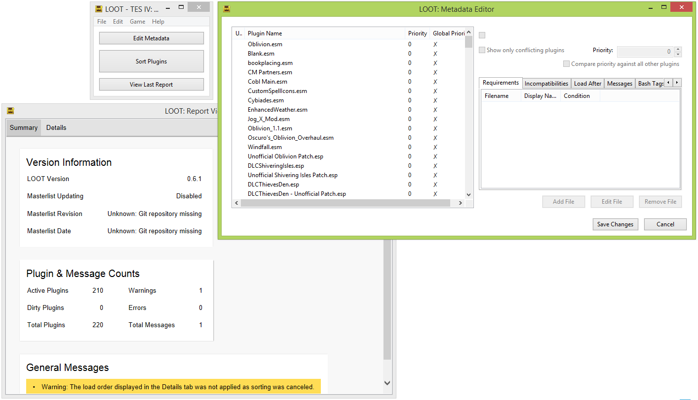
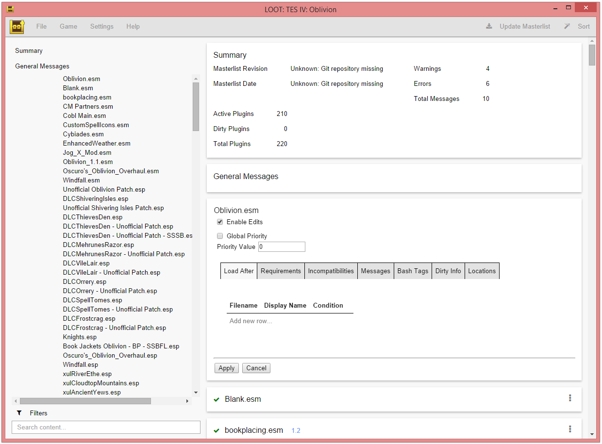
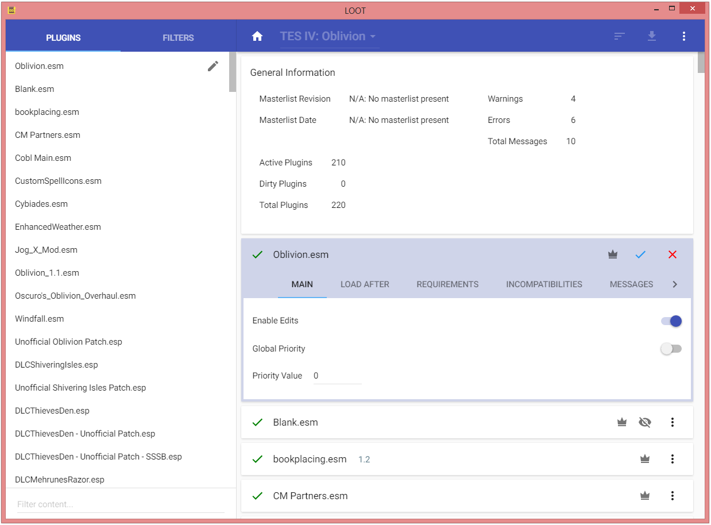

LOOT v0.7.0 has finally been released, after just over a year and 1000 commits made in development. Given that so much has changed, I thought I'd write a couple of posts giving a little insight into the major changes, what I learned and the decisions I made.

In this post, the first of two, I'll be covering the overhauled user interface.

## The Starting Point

*LOOT v0.6.1*

One of my chief dislikes with v0.6 was how messy its user interface was, and how many clicks it took to do anything. LOOT's primary functionality was spread across three separate windows, and it launched into a window that contained no content, which isn't a good start.

Most of LOOT's content is in the form of plugin messages, and they're independent of LOOT's sorting functionality, yet the user was forced to go through the process of sorting their mods before they would see any of the messages, and even then they were hidden away on a secondary tab in the report window.

There were also frustrating limitations, like being unable to drag and drop plugins in the metadata editor unless the conflict filter was enabled, due to how mouse button events were handled by the framework used (wxWidgets).

As such, version 0.7's main goal was to overhaul the the UI in order to fix these issues.

## Choosing A Framework

As I've alluded to above, I had grown frustrated by some of the limitations I was encountering using wxWidgets to build my user interface, so for v0.7 I wanted to try something new. I chose to implement the UI using HTML, CSS and JavaScript, rather than native Windows UI elements, because I felt (however wrongly) that native elements were by their nature more static and so would be more likely to throw in further limitations as development progressed. I find that HTML gives you a lot of flexibility, with relatively poor performance as the main tradeoff.

In addition, LOOT has always been an experimental, pushing-my-boundaries project to me, with producing something that's useful to other people almost a secondary goal to learning. I'd been messing around with HTML for years, and already implemented BOSS's and LOOT's sorting reports with it, so I also just wanted to see what I could do.

With LOOT v0.6, I'd made the terrible mistake of using Windows' built-in IE-based browser to display the report. I hadn't realised that "removing" IE would also stop the built-in browser from being updated, so this turned out to be a nightmare of inconsistent versions and compatibility. For v0.7, I wanted to avoid that by using a separate browser engine. After some research, I decided on using the Chromium Embedded Framework (CEF). The main alternatives were:

* Qt's WebEngine, but it only has one-way communication between C++ and JavaScript, and its bundled version of Chromium was relatively old.
* Brackets Shell, which itself used CEF, but also Node.js. I already had a C++ backend that I wanted to keep, so bundling a JavaScript backend was an unnecessary complication.

## Initial Design

*LOOT v0.7.0 at alpha 4, with an early UI design. The space to the left of plugins in the sidebar is for status icons, and the layout of the metadata editor panel is clearly unfinished.*

By keeping everything happening in the same window, I thought it would be easier for the user to follow the flow of operation: as a basic example, there's no chance of a new window opening hidden behind another. It also forces a more organised and efficient UI, as with a multi-window UI, you've can let the UI elements sprawl over several times the desktop area, but with one window more thought has to put into making everything coexist well.

I started with v0.6's report window, combining the two tabs, and adding the menu bar used in the startup window. The report filters were initially implemented as a button in the menu bar. Adding the Update Masterlist and Sort buttons to the far right of the menu bar separated those main actions from the secondary actions and other functionality on the left of the menu bar. With these changes made, I had already combined two of LOOT's three main windows.

With this design, LOOT launches straight to what was previously the report view, and displays the plugins in their existing load order, along with any messages from the masterlist if it is present. While this does require a progress bar on launch, reading and evaluating the masterlist takes much less time than sorting does, so the user still gets to content faster and with no interaction required.

I decided to keep the Settings and About dialogs, but implemented within the same window as overlay dialogs, as otherwise I'd need to use interprocess communication between the dialogs and the primary window, and that sounded more complicated than necessary.

I then had to figure out how to fit the load order confirmation view and the metadata editor into the UI. The confirmation view was easy: once a load order had been calculated, the plugin cards would be rearranged into their calculated load order, and the Update Masterlist and Sort buttons would be replaced with "Apply" and "Cancel" buttons.

The metadata editor design took a bit more thought. Initially, I considered having an editor dialog launched by clicking an edit button on each plugin's card, but I decided that squeezing a list of plugins into such a dialog (so that relative positions could be compared), was inefficient. Instead, the list of plugins was implemented as a sidebar, which doubled as a list of quick-access links to plugin cards. The metadata editor was implemented on the reverse of the plugin cards, so that each plugin had its own editor: this was inspired by the (now-redesigned) access to customisation options for Google Now's cards. It was at that point I moved the filter options to the sidebar: in this design (visible in the image above), they replace the plugin list when the "Filters" item is clicked.

The new UI allowed for some useful functionality that previously wasn't possible, or had been implemented in a more roundabout manner:

* Plugins could be drag 'n' dropped into editor tables without needing to first enable the conflict filter!
* Content could be copied simply by selecting it and using <kbd>Ctrl C</kbd>, rather than requiring a menu entry.
* Multiple plugins could have their metadata edited at the same time.

## Switching To Material Design

*LOOT v0.7.0 at release.*

I didn't decide to base the UI design off Google's Material Design until 6 months into development. It was a decision borne by my frustration at knowing that the UI I had built looked a bit rubbish, but not knowing *why*.

I've gone into my reasons for choosing Material Design in my post on [redesigning LOOT's website](), where I also touched on a few problems I'd encountered using Polymer to implement it. I’ll go into the additional problems I experienced using it in LOOT itself, but first a bit about how Material Design prompted some changes.

### Changes

#### The Application Toolbar

While my initial design had a menu/toolbar hybrid, Material Design recommends that the toolbar only contain navigation elements and a few commonly-used action elements, and to put other actions and menu items into a single overflow menu.

I had already placed action buttons for masterlist update and sorting into the toolbar, but I moved their text into tooltips. The contents of the File and Help menus were moved into a new overflow menu, as was the Settings dialog link.

I decided to keep the Game menu in the toolbar, but turned it into an oversized dropdown selection element, so that the same element could clearly convey which game LOOT is currently running for, and also be the mechanism for changing to another game.

I experimented with using icon buttons for applying or discarding a sorted load order, but found that users thought they were too difficult to spot, so the buttons remained as text, and I emphasised the Apply button by inverting its colour scheme.

#### The Sidebar

Material Design's element spacing guidelines sacrifice information density for accessibility, and this meant that the sidebar could display far fewer plugins at a time than before. With vertical space at a premium, the filters were moved into an entirely separate page within the sidebar, and Plugins and Filters tabs placed in the application toolbar. The application toolbar was then visibly split in two between the sidebar and the main content area, to mark out the area that was controlled by the tabs.

The Summary and General Messages cards were combined into a General Information card, so that their content would take up less vertical space, and their two sidebar items could instead be replaced by a single button in the application toolbar, where there is plenty of horizontal space.

In the pre-Polymer UI sidebar, there is a lot of space to the left of the plugin filenames, which was used to display status icons for each plugin.
These icons were culled down to one icon, and it was moved to the right of the plugin name. I chose the "Has User Metadata" icon, as it was the only one that communicated a state that LOOT could change. The other icons were moved into the plugin cards, where there is more room for them, and the user metadata icon is also displayed there for completeness.

#### The Metadata Editor(s)

The initial design of the metadata editor was a bit of a mess, I wasn't really sure how best to arrange the tabbed tables together with the other three controls (Enable Edits, Global Priority, Priority Value). After trying a few different layouts with the Material Design elements, I settled on puting those controls in their own tab, which the editor would open into. Lacking a better name, I just titled it "Main".

The Apply and Cancel buttons I moved into the card's header as icon buttons, as they had to exist outside of the tabbed content, and that distinction was lost when they were positioned at the bottom of the card. I had to use a blue tick for the Apply button, to avoid confusion with the green "Active Plugin" tick that could be displayed on the left of the card header.

Unlike the sorting apply and cancel buttons, users had no trouble with icons being used instead of text. I suppose this is because: they're in a similar spot to where the editor was opened from, so there's some symmetry; there's a lack of other available elements that might perform those actions; and the buttons are always present there, so they're noticed as soon as the editor is opened, rather than the user needing to notice a change.

The background colour was set to light purple and a border along the bottom and sides was added after user feedback suggested difficulty in distinguishing cards with open editors from others. To help quickly find open editors, I also later added the pen icon to plugins in the sidebar that had open editors, as seen in the image above.

### Deviating From The Spec

LOOT v0.7.0 largely follows the Material Design spec, but it does make some slight deviations:

* There are a few spacing tweaks, like filter checkbox labels being closer to their checkboxes, and table cells having less padding.
* Animation were not used when switching tabs, for performance reasons. They'd be nice to have if performance improves in the future.
* Toolbars use the mobile spec heights, instead of the taller desktop heights, and sidebar plugin items are less than half the spec height, to improve information density.
* Some text uses smaller font sizes. For sidebar items, this was done to match the shorter heights, and for plugin card titles, it was because on cards with no messages or tags, the large titles looked unbalanced.

I'm still not happy with the information density of LOOT v0.7.0's user interface, and I will continue to work on it in the future. I'd like to further reduce the vertical space taken up by each sidebar plugin item, and improve the use of the horizontal space available to tables in the settings dialog and editors.

I'll be investigating the option of allowing the user to scale the whole UI, which may go a long way to helping improve its information density. Other than that, table column widths can be tweaked to give more room to columns which would expect longer values, I'd like to make the sidebar width adjustable, and I might experiment with mutli-line input wrapping for table inputs.

### Polymer Problems

Choosing to build an application using a framework that is in a pre-alpha state is not a particularly good idea. As v0.7.0's release shows, it can be done, but it certainly wasn't without problems.

Working against an unstable API is a headache: when I started using Polymer, it was at v0.4.2, and it went through several breaking releases until it reached v0.5.5, which LOOT v0.7.0's release uses. Polymer v0.5.x is still pre-alpha though, with the recent v0.8 alpha and v0.9 beta releases happening too recently for inclusion in LOOT's v0.7.0 release, as they're both breaking changes and not all the elements had yet been updated for them.

Being part of an immature codebase, the Polymer elements I used had a few bugs and quirks to their behaviour. In some cases these took a long time to fix or work around, and I had to fork a few elements to resolve some issues. Unfortunately, but there still remains one cosmetic bug in the v0.7.0 release that I was unable to fix, which isn't great, but I'm keeping my fingers crossed that a future update will fix it.

The biggest problem I had using Polymer was that it destroyed the performance of my UI. In pre-alpha, at least, the data binding and other magic Polymer uses runs a lot slower than my previous code did. The plugin card list was hit hardest, as there could be hundreds of cards, and thousands of messages. With 220 plugins, the initial load took 32 seconds, where pre-Polymer it took 5 seconds (and most of that 5 seconds was spent loading the data).

The obvious mitigation strategy was to use a virtual list for the sidebar and the cards list. LOOT requires a virtual list that can handle elements of different and variable heights, which most HTML virtual lists don't support. Luckily, the Polymer team provides a `<core-list>` element that does the job. Adapting the cards to a virtual list took a while, as the implementation uses CSS transforms to position a small number of cards, recycling any that disappear off one edge so that they reappear on the other. This meant that all the data on the card, including input values, had to be recorded in JavaScript objects so that it was not lost, and then set to the correct new values when the card was recycled.

I also spent some time optimising the code by deferring calculations until they were necessary, and trying to cache the results for when the underlying data hadn't changed. For example, metadata editor content is only initialised when the editor is opened, or a card that had its editor open is recycled back into view. I also tweaked the styling changes made when switching tabs, to avoid content reflow. There is still some lag when applying some content filters, and when toggling the sidebar tabs, but this will probably be resolved in the near future when LOOT updates the version of Polymer it uses.

## Casualties & The Future

Unfortunately, the change to a new user interface was not without its casualties:

* The ability to search the plugin cards was lost, as Chromium's built-in search doesn't work with the virtual list elements.
* Filter state is no longer remembered between instances of LOOT.
* Users can now only create messages with a single language string, there's no UI for providing multilingual messages.

The first two casualties will be resurrected for a release in the near future. I haven't had any polyglots complain about the third feature going missing.

The v0.7.0 release has given LOOT's UI a strong foundation to build off. There's still a lot of refinement to be done, my list of potential feature enhancements includes autocomplete suggestions for Bash Tag and filename inputs. The adventure continues!
