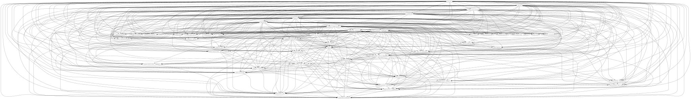

LOOT v0.7.0 has finally been released, after just over a year and 1000 commits made in development. Given that so much has changed, I thought I'd write a couple of posts giving a little insight into the major changes, what I learned and the decisions I made.

In my [first post](), I covered the many significant changes made to the user interface since v0.6. In this post, I'll cover how LOOT's sorting algorithm improved too.

## Why Make Changes?

Changes to a user's load order can have a detrimental effect on the stability of their game, so it's not wise to make changes unless starting a new character. It's a much less serious issue than removing mods from an existing game, but there's still a chance of trouble, so it's best avoid load order changes wherever possible. Given that, why did I make changes for LOOT v0.7.0?

The short answer is that sorting in v0.6 was broken. The long answer is the rest of this post.

## LOOT v0.6's Sorting Algorithm

LOOT's sorting algorithm is based on the construction of a directed acyclic graph, followed by a topological sort. The graph represents all the plugins in the user's load order as vertices (ie. points) and their interactions and interdependencies as edges (ie. lines). The graph is directed because the edges have a direction, pointing from one vertex to another, and acyclic because the graph doesn't contain any cycles (ie. loops). The topological sort turns the graph into a list by travelling from vertex to vertex following the edges. It's therefore the edges that decide the load order that LOOT calculates, so they're the interesting bit.

The edge construction part of the sorting algorithm in v0.6 is as follows:

1. For each plugin
    1. Loop through all the other plugins. If the plugin is a master (ie. has its master flag set), add edges going to non-master plugins. If the plugin is a non-master, add edges coming from master plugins.
    2. Loop through the plugin's own masters, adding edges coming from them.
    3. Loop through the plugin's requirements metadata entries, adding edges coming from any of the plugins found.
    4. Loop through the plugin's "load after" metadata entries, adding edges coming from any of the plugins found.

    Each time an edge is added coming from a plugin, the current plugin's priority is set to that plugin's priority if the latter is higher than the former.

    *Although I said above that the graph is acyclic, cycles can form due to the edges added in this step of the algorithm, if a load order contains a broken plugin, or if some metadata is wrong. That's why LOOT can complain about cyclic interactions.*
2. For each plugin, loop through all the other plugins and add edges where the priority values of the two plugins differ, and they either conflict or one or both of them has a global priority value.

    Edges are added going from the plugin with the lower priority to the plugin with the higher priority, unless adding the edge would cause a cycle in the graph (eg. A&#x21C4;B), in which case the edge is not added.
3. For each plugin, loop through all the other plugins and add edges between plugins that conflict. Like for priorities, cycle-causing edges are skipped. The direction of edges added can depend on two things:
    1. The number of override records. Override records are not newly added by the plugin, but are (often edited) copies of records from the plugin's masters. The edge is added going from the plugin with more override records to the plugin with fewer override records.
    2. If the two conflicting plugins have the same number of records, a naive lexicographical comparison of their filenames is made (which goes character-by-character, comparing binary values), so that the edge is added from lexicographically earlier plugin to the later plugin.

So what's wrong with this?

## Hamilton Really Got Around

William Rowan Hamilton, that is, and in an intellectual sense, because he has a [Wikipedia page](https://en.wikipedia.org/wiki/List_of_things_named_after_William_Rowan_Hamilton) devoted to listing stuff named after him. The relevant concept in this case is the [Hamiltonian path](https://en.wikipedia.org/wiki/Hamiltonian_path), which is a path that visits each vertex in a graph exactly once. It has the useful property that if a graph has a Hamiltonian path, it is the unique result of a topological sort of that graph.

This means that topological sorting that graph will always produce the same result, being the Hamiltonian path, and conversely if a Hamiltonian path doesn't exist, topological sorting can produce one of a set of possible results, where the size of the set is greater than one.

LOOT v0.6's sorting algorithm is broken because some plugins can be left without edges between them, so they can be put in either order relative to one another. Consider a load order that contains only two plugins A and B, where

* both are non-master plugins with no metadata,
* neither is a master of the other,
* both have the same priority value,
* the two plugins don't conflict.

The v0.6 sorting algorithm, as given above, would add no edges between the two, and so there are two possible results to the topological sorting: A&#x2192;B or B&#x2192;A.

Sorting multiple times with LOOT v0.6 can therefore produce a different load order each time. It's unclear what decides which sorting result occurs, so there's no way to force it to produce the same result every time. The issue didn't always occur, which is why (along with me not knowing about Hamiltonian paths at the time) the issue managed to sneak past testing, but it can be a serious problem for users.

## Changes In v0.7.0

There are two changes in v0.7.0 that affect the result of sorting.

The first change is that the sorting algorithm was tweaked so that if two conflicting plugins had the same number of override records, an edge was *not* added, instead of comparing their filenames. A fourth step was then added:

> For each plugin, loop through all the other plugins and add edges between plugins that don't already have any between them. Like for priorities and conflicting plugins, cycle-causing edges are skipped. The edges are added from the plugin that loaded earlier in the previous load order, to the plugin that loaded later.

This fourth step ensures that a Hamiltonian path exists, as every plugin now has its position relative to every other plugin defined by one or more edges.

At first, the new fourth step used a more discerning filename comparison, but I was eventually persuaded to use the previous load order positions instead, as doing so would cause no changes to the load order when a user updates from v0.6, whereas the filename comparison would move many plugins around.

Now, LOOT v0.7 *does* produce slightly different load orders, but that's because of the second change, which is that a bug in the plugin reading code was fixed. This bug was causing some records to be skipped, so some plugin conflicts were not being detected. With the bug fixed, these conflicts are detected, and so sorting produces a slightly different result compared to v0.6.

## Visualising The Plugin Graph

This isn't really particularly relevant to the above, but is a neat topic on which to finish this post. Sorting a load order of *N* plugins with v0.7 produces a graph with *M* edges, where

<math display="block">
  <mi>M</mi>
  <mo>=</mo>
  <mfrac>
    <mi>N</mi>
    <mn>2</mn>
  </mfrac>
  <mo>(</mo>
  <mi>N</mi>
  <mo>&#x2212;</mo>
  <mn>1</mn>
  <mo>)</mo>
</math>

as there is an edge between every pair of plugins. This means that my Skyrim load order, which contains 48 plugins, produces a graph with 1,128 edges. Most edges are duplicates or otherwise equivalent to other combinations of edges that describe the same path, but it's more efficient just to add all these extra edges than to check if an edge is needed before adding it.

The image above (open it in a new tab to view it properly) was generated from the plugin graph of my Skyrim load order, using a very early build of LOOT. It contains a paltry 504 edges, but as you can see, it's still way too complex to be of any use, which is why the image generation feature was removed.

One of my ideas for helping users understand the changes LOOT makes is to reintroduce graph visualisation, but only display the non-equivalent edges that have been added or removed since LOOT was last run. For example, if LOOT downloads a masterlist update that adds a "load after" metadata entry making B load after A, then this could be visualised as the A and B vertices with a green line pointing from A to B.

That's still just an idea though, and whether or not it ever sees the light of day depends on several factors, not least the performance impact: the graph image above took several minutes to be generated!
