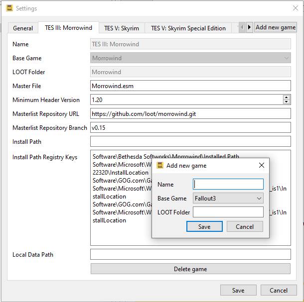
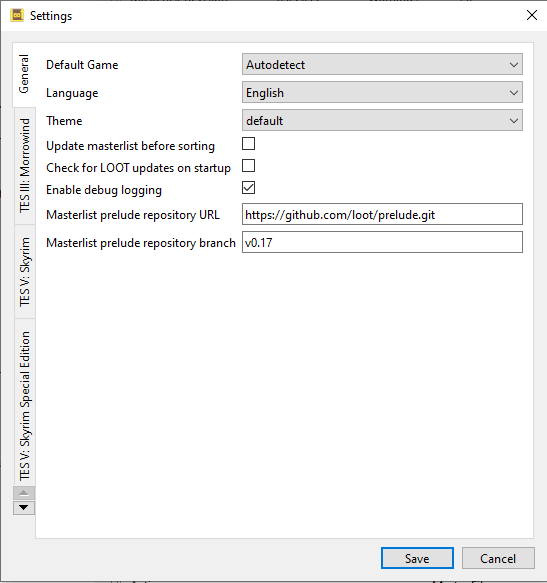
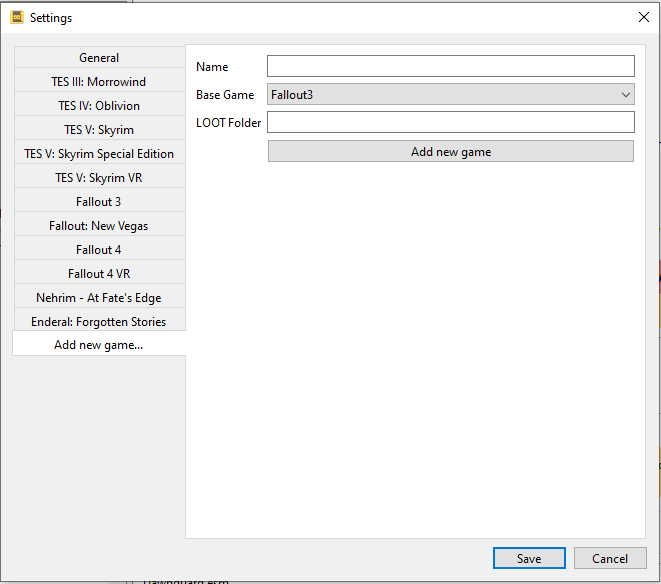
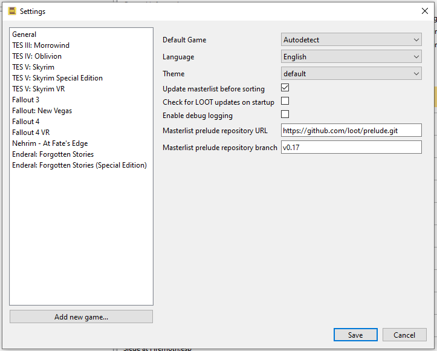

I recently reimplemented [LOOT](https://loot.github.io)'s user interface using Qt, and one of the issues I had was with the layout and styling of its settings dialog. My initial implementation used a horizontal tab bar to display each settings page in a separate tab:



The "Add new game" button is a "corner widget" - it's a bit ugly, but this was all written without any effort into making things look good, and that's a natural position for a "new tab" button.

Unfortunately, with LOOT supporting 12 different games, using the tab bar meant a lot of scrolling, and one suggestion was to arrange the tabs in a vertical list to the left of the pane area instead. Qt's `QTabBar` does support vertical tabs, but only with text that also runs vertically, which just makes readability worse:



Note that the "Add new game" button has gone missing - it turns out that corner widgets are only supported for horizontal tab styles.

I had a search around to see if there were any existing solutions, and sure enough I wasn't the only person wanting vertical tabs with horizontal text.

Some [suggested](https://stackoverflow.com/questions/50578661/how-to-implement-vertical-tabs-in-qt) overriding `QTabBar::paintEvent()`, but the code snippets I saw seemed pretty simplistic, not handling cases like if you've got more tabs than space to display them. I had a look at the source code for `QTabBar` and its `paintEvent()` has a lot going on - much of it using private member variables that I wouldn't have access to if I overrode `paintEvent()`. I decided against trying that approach.

Instead, I subclassed `QProxyStyle` to rotate the text before it got painted. I think I got that approach from [this forum post](https://forum.qt.io/topic/131802/setting-qproxystyle-on-tabbar-overrides-palette). The code for that looked like this:

```cpp
class VerticalTabStyle : public QProxyStyle {
public:
  QSize sizeFromContents(ContentsType type,
                         const QStyleOption *option,
                         const QSize &size,
                         const QWidget *widget) const override {
    QSize s = QProxyStyle::sizeFromContents(type, option, size, widget);
    if (type == QStyle::CT_TabBarTab) {
      // Transpose swaps the height and width of a rectangle, turning it on its
      // side. We've got a vertical box, and we want to rotate it to be a
      // horizontal box instead, so that the text has enough room to run
      // horizontally instead of vertically.
      s.transpose();
    }
    return s;
  }

  void drawControl(ControlElement element,
                   const QStyleOption *option,
                   QPainter *painter,
                   const QWidget *widget) const override {
    if (element == CE_TabBarTabLabel) {
      const QStyleOptionTab *tab =
          qstyleoption_cast<const QStyleOptionTab *>(option);

      if (tab) {
        QStyleOptionTab opt(*tab);

        // RoundedNorth is the default style for horizontal tabs that run along
        // the top of the tab widget. Using this shape means that the text will
        // be printed running horizontally. Because we're only setting this
        // shape when the element is the tab label, it doesn't affect how the
        // tab's borders are drawn.
        opt.shape = QTabBar::RoundedNorth;

        QProxyStyle::drawControl(element, &opt, painter, widget);
        return;
      }
    }

    QProxyStyle::drawControl(element, option, painter, widget);
  }
};

class SettingsWindow : public QDialog {
  Q_OBJECT
public:
  //...

private:
  //...
  QTabWidget * tabWidget;
  VerticalTabStyle verticalTabStyle;

  void setupUi() {
    //...

    tabWidget = new QTabWidget(this);

    // Arrange the tabs along the left hand side of the window.
    tabWidget->setTabPosition(QTabWidget::West);

    // Use the custom style when displaying the tabs.
    tabWidget->setStyle(&verticalTabStyle);

    //...
  }

};
```

Because the tabs are still positioned vertically, the corner widget still isn't
an option: instead I added another "Add new game..." tab that contained the
content of the dialog displayed in the screenshot above. Here's what it looked
like:



That worked well, and it looked a lot better than the previous tabs. However, the [documentation](https://doc.qt.io/qt-6/qstyle.html) for `QStyle` warns that:

> Qt style sheets are currently not supported for custom QStyle subclasses.

This meant that the `QProxyStyle` worked fine while the style sheet didn't change anything other than some "safe" properties (e.g. the text colour), but the moment anything else changed (e.g. the borders), the proxy style was ignored and the tabs went back to being displayed with vertical text.

After trying various workarounds, I *almost* got it working by setting the tab position to `QTabWidget::West` and overriding `QTabBar::initStyleOption()` to set the shape to `QTabBar::RoundedNorth`. Unfortunately this affects the whole tab, not just the text, meaning that borders get drawn in the wrong places. The result is that it works fine if you're replacing the borders in your theme, but not if you're using the default theme.

I tried to only override the style shape for the tab label, similar to what the code above does, but the same style option seems to get used to paint everything in the tab. I also tried to detect when there was a style sheet causing the custom style to be ignored, so that I could use this approach only if the custom style wasn't being used (because if I'm replacing the borders in my theme I don't really care if they get painted incorrectly by default), but couldn't figure out how to do that.

I haven't seen the `QTabBar::initStyleOption()` approach written about anywhere, so here's the code for that in case anyone's interested:

```cpp
class VerticalTabBar : public QTabBar {
public:
  VerticalTabBar(QWidget *parent) : QTabBar(parent) {
    setDrawBase(false);
  }

protected:
  void initStyleOption(QStyleOptionTab *option, int tabIndex) const override {
    QTabBar::initStyleOption(option, tabIndex);

    // Unfortunately this is used for everything when painting the tab bar,
    // causing borders to be drawn incorrectly.
    option->shape = QTabBar::RoundedNorth;
  }

  QSize tabSizeHint(int index) const override {
    auto sizeHint = QTabBar::tabSizeHint(index);

    sizeHint.transpose();

    return sizeHint;
  }
};

class VerticalTabWidget : public QTabWidget {
public:
  VerticalTabWidget(QWidget *parent = nullptr) : QTabWidget(parent) {
    setTabBar(new VerticalTabBar(this));
    setTabPosition(QTabWidget::West);
  }
};
```

In the end, I gave up on using `QTabWidget` and instead displayed the tabs as entries in a `QListWidget` that is positioned to the left of the tabs content, which is managed by a `QStackedWidget`. It's a common layout, but I think it suffers from a lack of visual association between the selected list item and the content displayed. Here's what it looks like:


