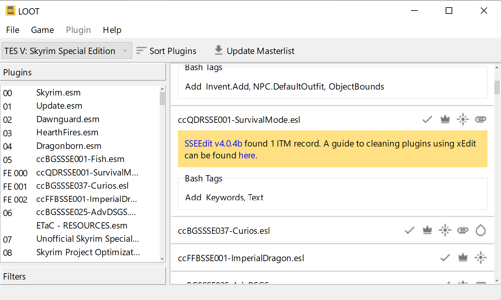
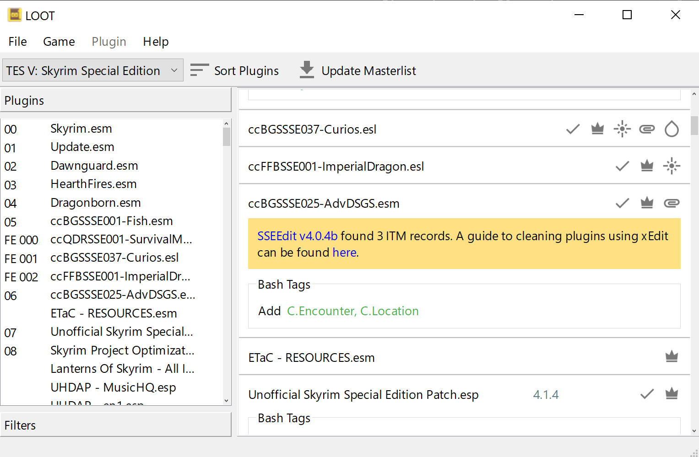

When I wrote about my experience of reimplementing [LOOT's](https://loot.github.io/) user interface using Qt (see [Reimplementing LOOT's user interface with Qt](), [Custom interactive list elements with Qt]() and [Horizontal text in themeable vertical tabs with Qt]()), there were a few issues I came across that didn't really fit into any of those posts, and so I cut the snippets about them out into a separate draft document.

I think my intention was to write more around them about how to handle styling and desktop scaling when using Qt, but that didn't happen and instead the draft has languished untouched on my PC for over a year. I've decided that I'm not going to write an article like that any time soon, and it's best to just publish the snippets I've got, so here they are.

## Style Sheets and QPalette

While Qt's documentation says that it's possible to set all the colours defined by a `QPalette` in a style sheet, I found it was much easier to set the colours in a `QPalette` and then add style sheet rules to cover anything not affected by the `QPalette`.

The [documentation](https://doc.qt.io/qt-6/qpalette.html) for `QPalette` also says:

> Note that we do not use the Link and LinkVisited roles when rendering rich text in Qt, and that we recommend that you use CSS and the QTextDocument::setDefaultStyleSheet() function to alter the appearance of links.

However, this doesn't seem to be true when rendering Markdown text. I also found that `setDefaultStyleSheet()` doesn't allow you to override the link text colour for Markdown links, because their HTML equivalent uses an inline style to set that colour, which of course takes precedence over the default stylesheet. (I don't know if Qt actually converts Markdown to HTML or to some common internal structure, but it behaves as if it's HTML internally.)

In fact, if you want to change the colour used for link text in Markdown text without resorting to converting to HTML and then editing that, the only way that seems to work is to set the `Link` role in the palette.

## Loading Palettes

Given that it's useful to be able to specify palette colours for theming purposes, it would be good to have some way to load a palette from a file that could be provided as part of a theme's resources.

A `QPalette` can be read from a `QDataStream`, but that means storing the palette data in a binary (i.e. non-human-readable) format that's Qt-specific and Qt-version-specific, which isn't great for when you just want to tweak or create new themes without writing code or firing up a hex editor.

Instead, I decided to implement support for loading the palette from a TOML file, as LOOT already uses TOML for its settings file. Here's the dark theme's palette TOML:

```toml
# Different color roles affect different elements:
#
# window
#   - background for toolbar, status bar, toolbox and non-native dialogs
# windowText
#   - icons
#   - text in settings window, dialogs, metadata editor plugin name, metadata
#     editor group input label, metadata editor tab labels
# base
#   - background for cards, multiline text inputs, the sidebar plugin list, the
#     sidebar filters panel and the settings panel list
# placeholderText
#   - placeholders
# text
#   - most text
#   - disabled menu bar text
# button
#   - toolbox buttons
# buttonText
#   - buttons
#   - table section headers
#   - enabled tab bar scroll button icons
#   - menu bar
#   - toolbar buttons
#   - menu item shortcut text
#   - sidebar filters panel label text
# dark
#   - divider line in sidebar filters panel
#   - bottom and right borders of toolbox buttons
# mid
#   - disabled tab bar scroll button icons
#   - border around focused text inputs in metadata editor tables
# highlight
#   - selected (focused or not) sidebar list and metadata editor table elements
# highlightedText
#   - selected (focused or not) sidebar list and metadata editor table elements
#   - divider between menu bar and toolbar
#   - top and left borders of toolbox buttons
# link
#   - hyperlinks in rich text
#
[active]
window = "#212121"
windowText = "#E0E0E0"
base = "#303030"
placeholderText = "#B3FFFFFF"
text = "#FFFFFF"
button = "#757575"
buttonText = "#FFFFFF"
dark = "#424242"
mid = "#595959"
highlight = "#0078D7"
highlightedText = "#FFFFFF"
link = "#2979FF"

[inactive]
window = "#212121"
windowText = "#E0E0E0"
base = "#303030"
placeholderText = "#B3FFFFFF"
text = "#FFFFFF"
button = "#757575"
buttonText = "#FFFFFF"
dark = "#424242"
mid = "#595959"
highlight = "#0078D7"
highlightedText = "#FFFFFF"
link = "#2979FF"

[disabled]
window = "#212121"
windowText = "#4DE0E0E0"
base = "#303030"
placeholderText = "#B3FFFFFF"
text = "#4DFFFFFF"
button = "#757575"
buttonText = "#4DFFFFFF"
dark = "#424242"
mid = "#595959"
highlight = "#0078D7"
highlightedText = "#4DFFFFFF"
link = "#2979FF"
```

Much easier to work with!

## Icon Scaling with QIcon vs. QPixmap

LOOT uses SVG for its icons, and with the S standing for Scalable you'd think that icon scaling wouldn't be an issue. Unfortunately, that's only partially true.

LOOT displays icons on its plugin cards. These cards need to be rendered quickly, but loading icons is slow, so LOOT uses an `IconFactory` class to provide a global cache of loaded icons. Originally, this class would load the icon SVG into a `QPixmap`, set the appropriate colour and then resize the icon to the appropriate size (18 pixels high for card icons) before caching it.

This was fine, until Windows desktop scaling got involved.

With desktop scaling set above 100%, icons became horribly blurred and/or pixelated, for example:


*The icons are all blurred or pixelated.*

As far as I can tell, this was happening because QPixmap was resizing the SVG to an image 18 pixels high, independent of the desktop scaling factor. The `QLabel` that the `QPixmap` was fed into then had to scale that to a height of `18 * (desktop scaling factor)` pixels, but I think the original resizing must have turned the vector image into a raster image, because the result was a mess.

The fix was to feed the `QPixmap` into a `QIcon` and *then* ask for a `QPixmap` that is 18 pixels high. `QIcon` is aware of the desktop scaling factor (a.k.a. the device-pixel ratio) and takes it into account when performing the scaling.

Now the icons scale much better:


*There's still a little deformation on the update masterlist icon, but it's a lot better overall!*

---

That's all, folks!
