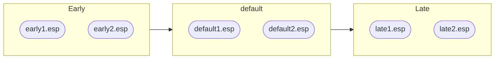

[LOOT](https://loot.github.io/) is a utility that helps people use game mods for Bethesda's Elder Scrolls and Fallout games. Mods for these games use plugin files to make changes to game data, and LOOT's main feature is sorting the order in which these plugins are loaded by the game to help avoid compatibility issues.

One of the most significant changes in the recent LOOT v0.19.0 release is a huge improvement in how quickly it can sort plugins, especially for larger load orders. Here are some measurements I made on my PC, which has an Intel Core i5-8400 CPU:

| Number of plugins | Time sorting with LOOT v0.18.6 / s | Time sorting with LOOT v0.19.0 / s|
|---|---|---|
| 450 | 10.0 | 1.41
| 924 | 142 | 6.34*
| 1619 | 1186 | 30.7
| 3228 | 15362* | 233
| 4620 | 58472* | 674

\* Estimated using trend line equations.

While I saw a measly ~ 39x improvement with 1619 plugins, one user with ~ 2300 plugins saw a ~ 246x improvement!

How was this feat accomplished? Well, I spent a lot of time looking at what the time sorting was being spent on, and tried to reduce the time taken in two ways:

1. Do less of the thing that is slow.
2. Do the slow thing faster.

In the end, I made five big improvements to sorting performance: they range from a trivial one-line change to almost literally going back to the drawing board (I don't have a drawing board, instead I went through a lot of those non-sticky post-it notes that come in cubes) to come up with a new approach for part of the sorting algorithm.

I'll explain each of these five big improvements in the order I made them, but before I dive into the technical detail, it's worth quickly going over how LOOT's sorting works. Before that though, I want to answer one big question.

## Why did it take so long to do this?

Back when LOOT was first created in 2012, the supported games could only load up to around 250 plugins at a time, and through dynamic merging (e.g. Bashed Patches) a very large load order might have around twice that. Load orders of 500 plugins were very rare.

As shown in the table at the top of the page, sorting 450 plugins using a mid-range CPU from 5 years ago took 10 seconds. The oldest CPU that meets Skyrim's minimum requirement is the Intel Core 2 Duo E6400. Depending on the benchmark used, my i5-8400's single-thread performance is 2.8x to 4.9x faster, which suggests that the worst case for sorting a Skyrim load order is under a minute. While that's not great, it's still reasonable considering how long it could take to manually sort a load order of that size.

However, the release of Skyrim Special Edition's v1.5 patch in 2017 increased that limit to around 4250 plugins. While I've never heard of a load order that large, I've seen users with between 2000 and 3000 plugins installed say that LOOT takes several hours (up to 8!) to sort their load order!

That's obviously terrible, but such large load orders are relatively rare: in 2 years only 6 people's experiences were noted on the relevant [GitHub issue](https://github.com/loot/loot/issues/1370).

So while it's been a possible problem for about 5 years and known problem for about 2 years, it was still rare enough that solving it wasn't a priority. I'd get around to it eventually, and that ended up happening in early December 2022.

## A brief overview of LOOT's sorting algorithm

Now that I've made my excuses, here's a brief description of how LOOT sorts plugins. For more detailed descriptions, see [LOOT's documentation](https://loot.readthedocs.io/en/latest/app/sorting.html) and [libloot's documentation](https://loot-api.readthedocs.io/en/latest/api/sorting.html).

LOOT uses a variety of data to do this sorting, enforcing the game's rules about loading different types of plugin and their dependencies, and taking into account metadata supplied by LOOT or the user. Some of these are "hard" rules that are always enforced, and others are "soft" rules that can be ignored if they would contradict a rule that's already been applied.

LOOT sorts plugins by representing them and their relationships as a [directed graph](https://en.wikipedia.org/wiki/Directed_graph), with each vertex being a plugin and the edges between the vertices indicating that the source plugin must load before the target plugin. It adds the edges in several stages, and then performs a [topological sort](https://en.wikipedia.org/wiki/Topological_sorting) of the graph to turn it into a list of plugins in load order.

The stages for adding edges are:

1. Specific edges (includes edges due to master flag differences, plugin masters, and load after and requirement metadata)
2. Hardcoded plugin edges (for games with hardcoded plugin positions)
3. Group edges
4. Overlap edges (for plugins that edit the same game data)
5. Tie-break edges (to ensure that sorting consistently produces the same result)

Group, overlap and tie-break edges represent soft rules, the others all represent hard rules.

### Avoiding cycles

A contradiction between rules is represented in the graph by a cycle. For example, given plugins A and B, if one rule said that A should load after B and another said that B should load after A, you'd end up with:


To avoid causing a cycle by adding an edge between two vertices in one direction, you need to check if there's already a path between them going in the other direction. If there is no such path, adding the edge won't cause a cycle.

LOOT uses a bidirectional [breadth-first search](https://en.wikipedia.org/wiki/Breadth-first_search) to find paths, which involves checking all the vertices that a vertices has edges going to (or from) in turn, and then checking each of those vertices' vertices, and so on. The implementation looks like this:

```c++
bool FindPath(RawPluginGraph& graph,
              const vertex_t& fromVertex,
              const vertex_t& toVertex,
              BidirVisitor& visitor) {
  std::queue<vertex_t> forwardQueue;
  std::queue<vertex_t> reverseQueue;
  std::unordered_set<vertex_t> forwardVisited;
  std::unordered_set<vertex_t> reverseVisited;

  forwardQueue.push(fromVertex);
  forwardVisited.insert(fromVertex);
  reverseQueue.push(toVertex);
  reverseVisited.insert(toVertex);

  while (!forwardQueue.empty() && !reverseQueue.empty()) {
    if (!forwardQueue.empty()) {
      const auto v = forwardQueue.front();
      forwardQueue.pop();
      if (v == toVertex || reverseVisited.count(v) > 0) {
        visitor.VisitIntersectionVertex(v);
        return true;
      }
      for (const auto adjacentV :
           boost::make_iterator_range(boost::adjacent_vertices(v, graph))) {
        if (forwardVisited.count(adjacentV) == 0) {
          visitor.VisitForwardVertex(v, adjacentV);

          forwardVisited.insert(adjacentV);
          forwardQueue.push(adjacentV);
        }
      }
    }
    if (!reverseQueue.empty()) {
      const auto v = reverseQueue.front();
      reverseQueue.pop();
      if (v == fromVertex || forwardVisited.count(v) > 0) {
        visitor.VisitIntersectionVertex(v);
        return true;
      }
      for (const auto adjacentV :
           boost::make_iterator_range(boost::inv_adjacent_vertices(v, graph))) {
        if (reverseVisited.count(adjacentV) == 0) {
          visitor.VisitReverseVertex(adjacentV, v);

          reverseVisited.insert(adjacentV);
          reverseQueue.push(adjacentV);
        }
      }
    }
  }

  return false;
}
```

As you may imagine, it gets slower the more vertices there are, and the more edges going to or from those vertices.

## How I measured performance

I've got a collection of 1619 plugins that I've amassed over the years from debugging peoples' load orders. It's not a working load order (some dependencies are missing, there are several plugins that are outright incompatible, and a few that aren't even valid plugins), but it's a large set of real plugins with a variety of interdependencies and overlaps and metadata associated with them, which is much better for testing how LOOT's performance scales than the small set of specially-made plugins I use to test LOOT's basic plugin interactions.

The most useful source of performance data was LOOT's debug log. Every log statement is printed with a timestamp that has microsecond precision (though tens of milliseconds was plenty), and when debug logging is enabled LOOT logs every time it adds an edge, saying what type of edge it is, and which plugins it goes from and to.

That means I can easily search the log to see how long it takes to run each stage of the sorting algorithm, and how many of each edge type was added. From that I can tell where I should be focussing my optimisation efforts, and also what (if any) impact my changes have.

I also used Visual Studio's CPU profiling tools to get more granular information about what code was taking the most time - this was most useful when I needed to dig into what was happening between each edge being added, to find out which (if any) code is taking most of that execution time.

Now, on to the optimisations!

## Choosing the right data structures

LOOT's plugin graph is implemented as an [adjacency list](https://www.boost.org/doc/libs/1_77_0/libs/graph/doc/graph_theory_review.html#sec:adjacency-list-representation) using the Boost Graph library, which stores a container of vertices and for each vertex a container of edges. The library lets you pick from a few different container types, and for some reason way back in [2013](https://github.com/loot/libloot/commit/2d307267a28dc2e8dfa6a58f7f68471f12f7705a#diff-a9316f4aeaa16e24c396afbde8b3079557c697100bb4ea6db2c157a6d6d4b6af) I decided to use `std::list`, which is usually a doubly-linked list.

A linked list is great if I'm inserting or removing elements anywhere in the container, but terrible if I'm iterating over them: unfortunately, LOOT does a lot of the latter and none of the former (LOOT never removes edges, and when it adds them they're just appended).

I [swapped](https://github.com/loot/libloot/commit/2bd3682109f0bcf875364ef04bd8fdeb3e9f4862) the `std::list` used to store edges with a `std::vector`, and that almost doubled sorting performance for me. One user with 2303 plugins saw their sort time go from 196 minutes to 36 minutes. Not bad for a one-line change! It just goes to show how important choosing the right data structure can be.

I also then did the same swap for the vertices container, but it didn't noticeably change sorting performance, which makes sense as it's generally much smaller and isn't iterated over as much.

## Avoiding unnecessary string encoding and case folding

LOOT allows plugins to be organised into groups, which can be made to load after other groups, so that all the plugins in one group will load after all the plugins in the groups that it loads after. For example:



is equivalent to:


Before starting to build the plugin graph, LOOT would first create a map of groups to all the other groups that they load after. For the example groups above, this would be:

| Key | Value |
|-----|-------|
| "Early" | [ ]
| "default" | ["Early"]
| "Late" | ["Early", "default"]

LOOT would then find all the installed plugins in each group, and use that to turn the map into a map of groups to all the plugins in groups that they load after:

| Key | Value |
|-----|-------|
| "Early" | [ ]
| "default" | ["early1.esp", "early2.esp"]
| "Late" | ["early1.esp", "early2.esp", "default1.esp", "default2.esp"]

In the sorting stage that adds group edges, for each plugin vertex LOOT would look up the plugin's group in the map to get the list of other plugin names that the current plugin should load after, and for each of those other plugin names it would get that plugin's vertex so that it could add an edge between the two vertices.

As shown in the examples above, plugins are referred to by their filenames, but filenames are case-insensitive in Windows, so comparing filename strings generally needs to be done case-insensitively. I'm glossing over a whole can of worms here, but accurately implementing case-insensitivity that behaves in the same way involves jumping through a few hoops called [`MultiByteToWideChar()`](https://learn.microsoft.com/en-us/windows/win32/api/stringapiset/nf-stringapiset-multibytetowidechar) and [`CompareStringOrdinal()`](https://learn.microsoft.com/en-us/windows/win32/api/stringapiset/nf-stringapiset-comparestringordinal), and that's really slow: 90% the time spent adding group edges was spent doing these string comparisons!

It would have been faster to only call `MultiByteToWideChar()` once per plugin filename instead of for every comparison, but I realised that the string comparisons aren't really necessary: if building the map that's used by the group edge sorting stage is delayed until the start of that stage, the map can be built using vertex references instead of plugin filenames because by then every plugin has a vertex in the graph. When adding edges for each plugin in the graph, LOOT then just needs to look up the other vertices in the map and add edges going from those vertices.

Cutting out the unnecessary string comparisons made adding group edges 10x faster. It wasn't the slowest stage of the sorting algorithm when I started, but it would have ended up being the slowest if I hadn't made this change.

## New tie-break logic

The slowest stage of sorting was the tie-breaking stage. It's the last stage that adds edges to the plugin graph, and it exists to ensure that LOOT produces a consistent sorted load order, by adding an edge between every pair of plugins that doesn't already have an edge between them. For example, if plugins A and B had no edges between them, should the load order be `[A, B]` or `[B, A]`?

The old logic was very simple: it would compare every pair of plugins in the load order to determine how the tie should be broken (assuming they are tied), and then add the appropriate edge so long as there wasn't already a path between those two plugins in the opposite direction.

The code was:

```c++
void PluginGraph::AddTieBreakEdges() {
  const auto logger = getLogger();
  if (logger) {
    logger->trace("Adding edges to break ties between plugins...");
  }

  // In order for the sort to be performed stably, there must be only one
  // possible result. This can be enforced by adding edges between all vertices
  // that aren't already linked. Use existing load order to decide the direction
  // of these edges.
  for (auto [vit, vitend] = GetVertices(); vit != vitend; ++vit) {
    const auto vertex = *vit;

    for (auto vit2 = std::next(vit); vit2 != vitend; ++vit2) {
      const auto otherVertex = *vit2;

      const auto thisPluginShouldLoadEarlier =
          ComparePlugins(GetPlugin(vertex), GetPlugin(otherVertex)) < 0;
      const auto fromVertex = thisPluginShouldLoadEarlier ? vertex : otherVertex;
      const auto toVertex = thisPluginShouldLoadEarlier ? otherVertex : vertex;

      if (!PathExists(toVertex, fromVertex)) {
        AddEdge(fromVertex, toVertex, EdgeType::tieBreak);
      }
    }
  }
}
```

The `ComparePlugins()` function compares the plugins' existing load order indexes, so that the plugin that currently loads later should continue to load later. (It also handles the possibility that an installed plugin may not have an existing load order position: the rest of the code doesn't need to care about that possibility, so I'm going to ignore it for the rest of this section.)

The logic in `AddTieBreakEdges()` has been effectively unchanged since LOOT v0.7.0, released in 2015. While simple, this approach scales *terribly*:

* It's \( O(N^2) \) with the number of plugins. To give an idea of what that means, I found that LOOT v0.18.6 sorted 1619 plugins in 1186 seconds, and 1114 seconds of that was just spent tie-breaking.
* The `PathExists()` call gets slower as more edges are added to the graph (it's a wrapper around the `FindPath()` function shown earlier), and the point of this method is to try to add an edge between every pair of plugins, so as it runs it gets slower and slower.

  For example, one user had a graph of 1200 plugins and 95970 edges before tie-breaking, which then took 393 seconds to add another 11133 edges. They then added all of those plugins to groups and re-ran sorting. This time the graph had 685007 edges before tie-breaking, which then took 1800 seconds to add another 10747 edges.

This is one of those cases where doing the same thing more efficiently wasn't going to be enough, I needed to rethink the whole approach.

> I'm going to be using [big O notation](https://en.wikipedia.org/wiki/Big_O_notation) to refer to how algorithms scale with their input. Unless otherwise noted, N refers to the number of plugins.
>
> If you're unfamiliar with big O notation, \( O(N) \) means that the running time of the function increases linearly with the number of plugins, so doubling the number of plugins approximately doubles the running time, and \( O(N^2) \) means that the running time increases quadratically, so doubling the number of plugins would approximately quadruple the running time.
>
> I'm using the notation a little loosely, ignoring what actually happens inside loops, because that level of precision gets a lot more complicated and isn't necessary to explain the optimisations.

### Hamiltonian paths

Taking a step back, the point of tie-breaking is to ensure that topologically sorting the graph can only give one result. This happens when the graph has a [Hamiltonian path](https://en.wikipedia.org/wiki/Hamiltonian_path), i.e. a path through all the vertices in the graph that visits each vertex exactly once. A graph that contains a Hamiltonian path is called a Hamiltonian graph.


In the two graphs above, `E -> F -> G -> H` is a Hamiltonian path. There is no Hamiltonian path for the first graph, as you can either visit A and B or visit C, but not all three of them. That could be resolved by adding an edge `B -> C` or by adding edges `A -> C` and `C -> B`, giving the Hamiltonian paths `A -> B -> C -> D` or `A -> C -> B -> D` respectively.

Checking if a graph is Hamiltonian is a [Hard Problem](https://en.wikipedia.org/wiki/Hamiltonian_path_problem), but we don't actually need to do that: we need to try to create a Hamiltonian path, which is thankfully much easier.

The thing is, if we're going to make a Hamiltonian path, what do we want that path to look like? Well, when the brute-force approach adds edges, it adds them to reflect the existing load order, so that changes aren't made to the load order unnecessarily. If no edges were added before sorting got to the tie-breaking stage, then tie-breaking would end up brute-forcing a Hamiltonian path that matches the existing load order.

### A new approach for the ideal scenario

My key realisation was that tie-breaking is essentially trying to recreate the existing load order as a Hamiltonian path through the graph, and doing it in pretty much the stupidest way possible.

Going back to the graphs above, if the Hamiltonian path we're trying to create is `A -> B -> C -> D` then the brute-force approach would end up with:


A more efficient approach would be to walk through the Hamiltonian path we're trying to create, and add any edges that are missing in the graph. `A -> B` and `C -> D` already exist, so we just need to add `B -> C`:


That's much better: it's not adding unnecessary edges, and iterating over the desired Hamiltonian path is \( O(N) \), so it'll scale much more efficiently.

The code for that would look something like this:

```c++
void PluginGraph::AddTieBreakEdges() {
  const auto logger = getLogger();
  if (logger) {
    logger->trace("Adding edges to break ties between plugins...");
  }

   // First get the graph vertices and sort them into the current load order.
  const auto [it, itend] = GetVertices();
  std::vector<vertex_t> vertices(it, itend);

  std::sort(vertices.begin(),
            vertices.end(),
            [this](const vertex_t& lhs, const vertex_t& rhs) {
              return ComparePlugins(GetPlugin(lhs), GetPlugin(rhs)) < 0;
            });

  // Now loop through each vertex except the last one (because we also look at
  // the next vertex, and there's nothing after the last one).
  for (auto vit = vertices.begin(); vit != std::prev(vertices.end()); ++vit) {
    const auto currentVertex = *vit;
    const auto nextVertex = *std::next(vit);

    // Look for a path going in the other direction.
    if (!PathExists(nextVertex, currentVertex)) {
        AddEdge(currentVertex, nextVertex, EdgeType::tieBreak);
    } else {
        // Here be dragons!
    }
}
```

There is one *slight* problem though: it only works if you can add all the missing edges without causing any cycles. Unfortunately, we can't just ignore the fact that the sorting might need to change the load order...

### Dealing with change

Say you get to the tie-breaking stage with an existing load order of `[A, B, C, D, E, F, G, H, I, J]` and a graph that looks like this:


How do we tie-break that?

Before we begin, it's worth noting that if adding an edge between plugins A and B would add a cycle, then we need to know what the path from B to A is, not just that it exists. It's easy enough to get the path while checking it exists (that's why the `FindPath()` function shown earlier takes a `BidirVisitor` parameter), so that's fine. This path will come in handy, and I'll refer to it as the "back-path" below.

Using the example above, let's start with the first two plugins in the existing load order, A and B. We want to add `A -> B`, but that would cause a cycle. The back-path is `B -> C -> D -> A`, and because these are the first two plugins we're processing, the solution is easy: do nothing. As it stands, the new load order will simply start with `B -> C -> D -> A`.

(A, B) has been processed, so move on to (B, C). There's no path from C to B, so we can add `B -> C`. It already exists, so that's redundant. Moving on to (C, D), it's the same story as (B, C).

(D, E) is a bit more interesting. We can add the edge `D -> E`, but that's not enough: because D was effectively moved earlier in the load order when dealing with the (A, B) back-path, we need to define E's position relative to the plugin(s) following D in the load order that's being built. This is done by starting at the end of that load order and working our way backwards, stopping when we reach a plugin that E can load after. We then add an edge from that plugin to E, and an edge going from E to the plugin after that plugin. I call this "pinning". Doing this adds the edge `A -> E`. There's no edge going from E to another plugin, because A was the last plugin in the load order being built.

(E, F) is like (D, E), so we can add `E -> F`, except that before adding that edge E is the last plugin in the load order being built, so we don't need to pin F's position.

(F, G) gives us another back-path to deal with: `G -> H -> I -> F`. We can't just do nothing like before, instead we need to pin the position of each plugin in the back-path in turn. The load order being built currently looks like `B -> C -> D -> A -> E -> F`. Starting with G, `F -> G`, `E -> G`, `A -> G` and `D -> G` would all cause a cycle, but `C -> G` would work. After adding that edge, we also add `G -> D`, because D is the plugin currently after C in load order that's being built. That edge already exists, so that's redundant. G is now pinned in place. Doing the same for the other plugins in the back-path adds the edges `A -> H` and `H -> E`. The load order being built now looks like `B -> C -> G -> D -> A -> H -> I -> E -> F`.

(G, H) is similar to (D, E), but H has already been pinned so nothing happens. The same is true for (H, I).

Finally, we get to (I, J). This is similar to (D, E), so we add `I -> J` and need to pin the position of J, which adds `F -> J`. The end result is a graph that looks like this:


There's obviously a Hamiltonian path: `B -> C -> G -> D -> A -> H -> I -> E -> F -> J`.

That's the new tie-breaking logic! It's certainly more complicated than the brute-force approach, and it took me a while to work through all the edge cases and off-by-one iteration bugs, but the example we've just gone through covers everything, and I don't think it was *that* bad.

There were a couple of choices that have a performance impact: the first is to search for a pinning position going backwards from the end of the load order, and the second is to search for the last plugin that a plugin *can* load after. If you were to search forwards from the start of the load order, or search for the last plugin that a plugin *must* load after, you'd end up looking for a lot more back-paths, which is significantly slower.

I'm not going to include the full optimised code inline, because it's about 250 lines long, but about 100 lines of that are comments, and 35 lines are logging: it can be found [here](https://github.com/loot/libloot/blob/0.19.2/src/api/sorting/plugin_graph.cpp#L1055-L1307) if you're interested.

As a result of this optimisation, one user with 2313 plugins saw their sorting time go from 2184 seconds to 162 seconds!

It's worth noting that this change does produce different sorting results. That's because breaking a tie creates new paths through the graph and so can affect the existence of ties between vertices that haven't been checked yet, so the order in which tie-breaking iterates over vertices makes a difference. I don't expect this to be an issue though, as tie-breaking by definition should only decide how a pair of plugins load relative to one another if their order doesn't matter.

## More efficient user interface updates

After changing the edge container type, avoiding string comparisons when adding group edges and reworking tie-breaking, the core sorting algorithm was no longer the slowest part of the overall sorting process. Most of the time was now spent recreating the data that would be displayed in the user interface: one user with 2803 plugins saw it take 268s, another with 2313 saw it take 88s, and a third with 1950 saw it take 53s. During this time the UI would completely freeze up, which is not a good user experience!

The first thing I noticed from the logs was that LOOT was getting the current load order a lot, once per installed plugin. That data is cached, but there's still a little overhead when retrieving it, and it was easy enough to change the code to only get the current load order once and use that for each plugin in the load order.

Once I'd done that, I noticed that each plugin was getting its active load order index twice using the same load order while building the data used to display the indexes in the plugins sidebar, so I removed the duplicate.

Neither of these changes had a significant impact on performance, but they helped me get the code into a state from which I could fix the real issue.

From my profiling using Visual Studio I knew that `Game::GetActiveLoadOrderIndex()` was taking up a lot of the UI refresh time, and that it was now called once per installed plugin. The result was then used to construct `PluginItem` objects, which are used to hold plugin data for the UI. The function definition is:

```c++
std::optional<short> Game::GetActiveLoadOrderIndex(
    const PluginInterface& plugin,
    const std::vector<std::string>& loadOrder) const {
  // Count the number of active plugins until the given plugin is encountered.
  // If the plugin isn't active or in the load order, return nullopt.

  if (!IsPluginActive(plugin.GetName())) {
    return std::nullopt;
  }

  short numberOfActivePlugins = 0;
  for (const std::string& otherPluginName : loadOrder) {
    if (CompareFilenames(plugin.GetName(), otherPluginName) == 0) {
      return numberOfActivePlugins;
    }

    const auto otherPlugin = GetPlugin(otherPluginName);
    if (otherPlugin && plugin.IsLightPlugin() == otherPlugin->IsLightPlugin() &&
        IsPluginActive(otherPluginName)) {
      ++numberOfActivePlugins;
    }
  }

  return std::nullopt;
}
```

It's going through the load order looking for the given plugin and counting the number of active plugins before then. This isn't ideal for two reasons:

1. As mentioned earlier, comparing filenames is relatively slow.
2. Because this function is called for every plugin, it means there are \( O(N^2) \) checks against each plugin.

Given that I also need the `PluginInterface` pointers returned by `GetPlugin()` to construct the `PluginItem` objects, it's much faster to map the load order to a sequence of `(PluginInterface, load order index)` pairs, as then the counting of active plugins is only done once and there's no need for filename comparisons. I implemented it like this:

```c++
template<typename T>
std::vector<T> MapFromLoadOrderData(
    const gui::Game& game,
    const std::vector<std::string>& loadOrder,
    const std::function<
        T(const PluginInterface* const, std::optional<short>, bool)>& mapper) {
  std::vector<T> data;

  short numberOfActiveLightPlugins = 0;
  short numberOfActiveNormalPlugins = 0;

  for (const auto& pluginName : loadOrder) {
    const auto plugin = game.GetPlugin(pluginName);
    if (!plugin) {
      continue;
    }

    const auto isLight = plugin->IsLightPlugin();
    const auto isActive = game.IsPluginActive(pluginName);

    const auto numberOfActivePlugins =
        isLight ? numberOfActiveLightPlugins : numberOfActiveNormalPlugins;

    const auto activeLoadOrderIndex =
        isActive ? std::optional(numberOfActivePlugins) : std::nullopt;

    const auto datum = mapper(plugin, activeLoadOrderIndex, isActive);

    data.push_back(datum);

    if (isActive) {
      if (isLight) {
        numberOfActiveLightPlugins += 1;
      } else {
        numberOfActiveNormalPlugins += 1;
      }
    }
  }

  return data;
}

std::vector<PluginItem> GetPluginItems(
    const std::vector<std::string>& pluginNames,
    const gui::Game& game,
    const std::string& language) {
  const std::function<PluginItem(
      const PluginInterface* const, std::optional<short>, bool)>
      mapper = [&](const PluginInterface* const plugin,
                   std::optional<short> loadOrderIndex,
                   bool isActive) {
        return PluginItem(*plugin, game, loadOrderIndex, isActive, language);
      };

  return MapFromLoadOrderData(game, pluginNames, mapper);
}
```

It's implemented generically as there are other parts of the codebase that can also make use of it but need different output data, like when getting conflicting plugins and discarding a sorted load order.

This significantly improved performance, but now most of the time was spent in the mapper function (specifically the `PluginItem` constructor). I couldn't see an easy way to speed up what the constructor was doing, but luckily calling the constructor is thread-safe, so I can do the mapping in parallel!

Going parallel did make the code more complicated, mostly because you're not allowed to throw exceptions when using STL parallelism, and so I used `std::variant<T, std::string>` as an intermediate representing the result or the error string for each mapping, and then had to process that collection of results. The `MapFromLoadOrderData()` function doubled in length so is a bit too long to include inline, but you can find it [here](https://github.com/loot/loot/blob/0.19.0/src/gui/state/game/game.h#L141-L231) if you're interested. I saw a 4x performance improvement in `PluginItem` creation with this change, on an Intel Core i5-8400 (a 6-core CPU with no [SMT](https://en.wikipedia.org/wiki/Simultaneous_multithreading)).

After these changes, the user for whom the UI refresh took 88s saw it take 0.53s, and the user for whom it took 53s saw it take 0.34s (they both had 8-core CPUs with SMT). The core sorting algorithm was once again the the slowest part of the sorting process.

## Splitting the plugin graph in two

Following all the previous optimisations, I'd seen sorting become over 159x faster than with LOOT v0.18.6, and I'd noticed that master flag edges were now accounting for about two-thirds of all edges added to the plugin graph during sorting.

Master flag edges are added going from each master-flagged plugin to all non-master-flagged plugins, because the game loads master-flagged plugins before the others. Since they're the first edges to be added to the graph, and because there are a lot of path searches that get slower the more edges there are, I thought it might be worth eliminating those edges.

Instead of having a single graph containing all plugins and enforcing the master flag rule within that graph, I split the graph into one containing master-flagged plugins and another containing non-master-flagged plugins. They are sorted separately and the sorted load order from the non-master plugin graph is appended to the sorted load order from the master plugin graph to give the full sorted load order.

This eliminated the need for master flag edges and so sped up path searches. Reducing the number of plugins in each graph also improved performance for code that scaled quadratically: given a load order with M masters and N non-masters, an \( O((M + N)^2) \) loop is slower than an \( O(M^2) \) loop followed by an \( O(N^2) \) loop.

Splitting the plugin graph in two does have one downside, in that the topological sort of the two graphs will no longer error when there's metadata that tries to load a non-master before a master. This is because any one graph can only include one of those plugins, and any rules that involve plugins that are not in the graph get skipped.

These errors are potentially useful, so I added a separate validation step that checks the masters to ensure that none of them have metadata saying they should load after any non-masters. Although it adds extra code, the checks take a negligible amount of time, in part because load orders tend to contain a relatively small number of masters, and they tend not to have much metadata attached to them.

Splitting the plugin graph in two increased the speed of adding group, overlap and tie-break edges by 1.90x for one user with ~ 2300 plugins, and I saw a 1.96x speed improvement with my test load order.

## To be continued?

Performance optimisation can take a lot of effort, but you get diminishing returns, and I think it's important to have a goal that's plausibly reachable or else you might never stop!

It took me a couple of weekends and a week of evenings in early December to do almost all of the work above, and then probably a couple more days cumulatively between Christmas and the release of LOOT v0.19.0 to split the plugin graph and fix some bugs introduced in the changes. For me, the goal was a combination of two slightly vague things:

1. Can LOOT sort a realistically large load order within a few minutes?
1. Have I reached the point where I can't see an obvious way to improve performance without too much effort?

I think the answer to both of those is yes: I am once again happy with LOOT's sorting performance.

One thing I wanted to do but have not yet managed is to rework how group edges are added to make it more intuitive and improve its cycle avoidance, because it's a nightmare to understand and doesn't work that well. Unfortunately, while I've come up with those improvements, the improved version is a *lot* slower and there are an annoying number of edge cases that have prevented the optimisations that I've thought of so far. So in a way the optimisation efforts continue, but on as-yet unreleased code.

I'd like to finish up by thanking everyone who commented on the [GitHub issue](https://github.com/loot/loot/issues/1370) about sorting being slow: even if there's no immediate response or action, sharing your experience like that helps build up data that's easily visible to project maintainers and can inspire people to get things done. Special thanks to diskdevl, sibir-ine, Cloud and Proud, and Rayden for their patience in testing my changes!
