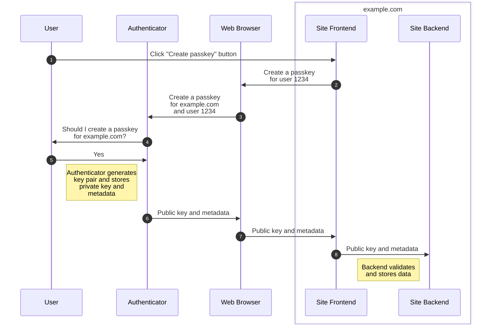
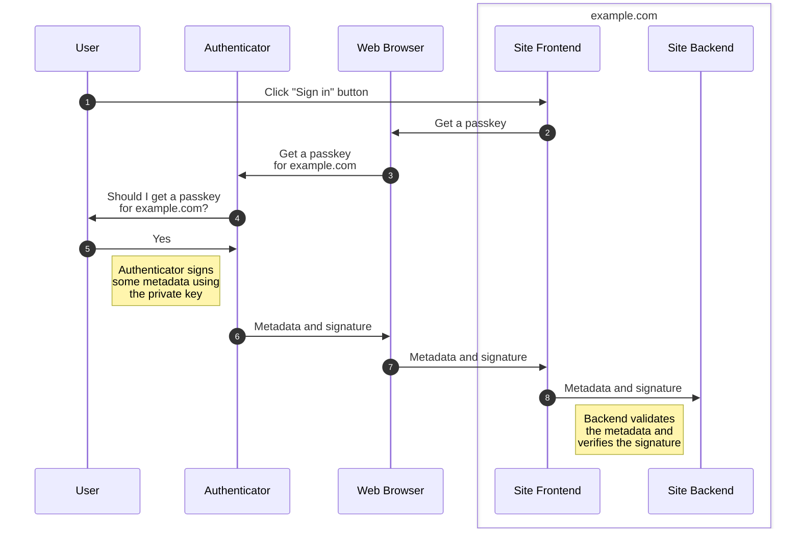

## What are passkeys?

A passkey is something that you can use to sign into a website. It's an alternative to using a username and password that's easier and more secure.

More technically, a passkey is a WebAuthn discoverable credential, which is an asymmetric key pair combined with some metadata that are used together to authenticate users as described by the WebAuthn specification.

## A very brief introduction to the relevant cryptography

A key is a number or combination of numbers that can be used to transform some data in such a way that it can only be practically transformed back to the original data using the same key.

An asymmetric key pair is a key that can be split into two parts (a public and a private key) such that the public key can only perform the transformation in one direction.

A hash is a number that's calculated from some input data such that:

- different random inputs are as unlikely as possible to produce the same result
- it's practically impossible to reverse the calculation or to pick some other input that will produce the same result.

A cryptographic signature is a number that is calculated by transforming the hash of some data using a private key. Given the data, the signature and the corresponding public key, you can transform the signature back into a hash, calculate the hash of the data and then compare the two hashes. If they are identical, the signature is valid, and you know two things:

1. Whoever generated the signature must have the private key corresponding to the public key that you have
2. The data has not been tampered with since it was signed.

## How do passkeys work?

I think the best way to explain how passkeys work is to walk through what's involved when you create a passkey and when you use it to sign into a website.

### Creating a passkey

Whether a passkey is created as part of account creation or done later, the high level process is the same:



The user handle `1234` in the diagram above must not leak identifying information (e.g. it can't be an email address), and the spec recommends it's a random number that's associated with the user's account.

### Sign in using a passkey

When you use a passkey to sign into a website:



If there is more than one passkey stored for a website, the authenticator will ask the user to pick which one it should use.

### WebAuthn Authenticators

An authenticator is what WebAuthn calls the component that's responsible for things like:

- generating the key pair
- securely storing the private key and its metadata
- sharing the public key and its metadata
- supplying signatures

The authenticator can be software or hardware, and is a bit like a password manager, but for passkeys: some existing password managers like 1Password and Bitwarden have already started to introduce support for acting as an authenticator.

When the authenticator asks you if it should create or get a passkey, it can do so in one of two ways:

- A user presence test: this could be a simple Yes/No dialog button click, or a button on a security key
- User verification: this involves the user verifying their identity somehow, e.g. by providing a PIN or password, or using biometrics.

A website can choose to discourage, prefer or require user verification each time it interacts with the authenticator, so you're not necessarily stuck using one way or the other.

## What advantages do passkeys have compared to passwords?

### They're not shared secrets

A password is a shared secret: both you and a website need a copy of the password, and so your account security is partially dependent on the website storing your password securely. Unfortunately:

- data breaches have exposed [billions](https://cybernews.com/security/billions-passwords-credentials-leaked-mother-of-all-breaches/) of password records
- stolen passwords account for [~ 20% of all login attempts](https://www.f5.com/labs/articles/threat-intelligence/2023-identity-threat-report-the-unpatchables)
- [63%](https://us.norton.com/blog/privacy/password-statistics) of social engineering attacks involve compromised credentials

A passkey involves no shared secret: the use of asymmetric cryptography means that the passkey data that the website receives and stores is not secret, and if it is exposed then there is no impact on security.

This reduces risk to users, and might also make websites less attractive targets: if you don't store passwords, then that's one less type of valuable data that an attacker might want to steal.

It's also easier for websites to implement passkey authentication securely, as while there are still checks that need to be performed, there's no need to store the passkey data with any more security than other account data, and with passwords there are significant choices to be made for an appropriate hashing algorithm and its parameters that are part of storing them securely. Supporting passkeys still involves making some choices that have security implications, but I don't think they add any new choices that are anywhere near as significant.

### No secret is transmitted when they're used

With a password, you almost always need to provide the password to the website to show that you know it. Every time you provide the password, there's a risk that it could fall into the wrong hands.

With a passkey, the private key is the only thing that needs to be kept secret, and it never leaves the authenticator.

It would still be possible to perform a replay attack against passkey authentication, except that the interactions with the authenticator involve the website providing a *challenge* value that it generates server-side, and which is included in the authenticator's output (similar to CSRF tokens in web forms). So long as that challenge is provided and handled correctly, an attacker that gets a copy of the authenticator's output can't really do anything with it.

### They're resistant to phishing

Phishing is a huge problem with password authentication: it's usually much easier to trick a user into visiting a website that looks legitimate than it is to break into the website or the user's computer, or to man-in-the-middle the connection between the two. Even when using a password manager with an autofill browser integration, I find that the autofill is unreliable and that I still have to copy/paste passwords into webpages often enough that I could probably be tricked into doing it on an attacker's website.

With passkeys, the authenticator is given (glossing over some details here) the domain name of the website you're on (e.g. `www.example.com`) by the web browser. When you create a passkey, the domain is stored alongside its private key, and when you use a passkey, the authenticator will only allow you to use a passkey with a matching domain. This means that you can't be tricked into using a passkey with the wrong website.

### They're unique to each website

It's easier to reuse passwords across website accounts than it is to use a unique password for each account. [Most people](https://us.norton.com/blog/privacy/password-statistics) reuse passwords, and some do so when when they use a password manager. Reusing passwords means that if one website is breached, your accounts on all the other websites that share the same password become vulnerable.

Passkeys are automatically uniquely generated per account, so this risk disappears.

### They're very strong by default

Unfortunately, [most passwords are weak](https://www.security.org/resources/online-password-strategies/), being short (less than 12 characters) and using common words and numbers, so they're easily guessed.

The strength of a passkey is dependent on the algorithm used for the key pair, but in practice they're highly unlikely to have less than 128 bits of security, which is similar to a random 22-character alphanumeric password or a random 10-word passphrase (which would take on average about a billion billion years to guess).

This also means that there's no need for websites to check password strength or check against lists of weak and leaked passwords, or have "fun" complexity requirements reminiscent of [The Password Game](https://neal.fun/password-game/).

### They're quick to check

This one's for website operators rather than users, but a good password hash is intentionally slow to calculate, using enough computation and memory to make cracking the hash infeasible, but not enough to make the login process too costly to run at scale.

In contrast, verifying a digital signature is much faster and less resource intensive: on my PC it's well over 1000x faster (ES256 vs ~ 100 ms for a password hash, on an Intel Core i5-8400).

## Improved sign-in user experiences

Passkeys allow for some interesting improvements to the user sign-in flow, including cross-device authentication and streamlined two-factor authentication.

### Cross-device authentication

If you want to log into a website, you can use a passkey that's stored on a different device. For example, I could log into Google on a shared PC using a passkey that's stored on my phone, so I don't need to enter any credentials on the PC.

Using cross-device authentication requires support from authenticators and client platforms, but doesn't need websites to do anything special.

### Two-click login

As the sequence diagram above implies, a website can supply a login form that is literally just a login button, because the metadata that's stored in the authenticator and sent to the website during login includes a user handle that the website can use to identify the user account that the password is for.

That's equivalent to the best-case scenario when using a password manager that autofills usernames and passwords, but with a simpler user interface.

### Seamless two-factor authentication

Two-factor authentication (2FA) means that to authenticate with a system a user must provide two separate pieces of evidence that they are who they say they are. The increase in security is based on the idea that it's harder for an attacker to be able to obtain both pieces of evidence than just one. Some common factors are given in the table below.

| Factor | Evidence type |
|--------|---------------|
| Password | A secret that only the user should know |
| A time-based code | A secret that was only given to the user when 2FA was set up |
| An email code | Access to read emails sent to the user's registered email address |
| An SMS code | Access to read messages sent to the user's registered phone number |
| A security key | Access to a physical device that only the user should have |
| Biometrics | Physical characteristics that should be unique to the user |

(Personally, I don't like using email or SMS for authentication because they're insecure channels, and I'd really rather not share my phone number with whoever ends up stealing my account data.)

A passkey can provide two factors:

- The signature is proof of knowledge of the private key
- User verification involves providing a secret (a password or PIN) or using biometrics

The website can trust when it receives data saying that the user was verified because the data is signed by the private key, so it must have come untampered from the authenticator.

This makes the user experience very smooth: whether setting up or using 2FA, the user just needs to click a button and then verify their identity when asked.

In contrast, setting up 2FA with a password can be a faff:

- SMS is the most common approach, and you need to provide your phone number, wait for a text message to arrive (hopefully you have signal!) and then read it off your phone and type it into the website
- Email isn't actually that bad, as although you need to wait for an email and provide the code in it, you're probably already signed into your email account and can probably copy/paste the code
- Time-based (TOTP) codes don't need any connectivity, but you do need to scan a QR code or copy a secret into your password manager and then provide a time-based code that's generated using it, which can be awkward. You're often also provided with a list of recovery codes to keep secure in case you lose access to your TOTP secret, so you also need to store them somewhere.

I've never used a security key so can't comment on the experience, and the only way for a website to use biometrics is if they're already using passkeys or WebAuthn non-discoverable credentials, which can use the same 2FA flow as passkeys.

Signing in with a password and 2FA is a similar experience (except getting TOTP codes is simpler than setting it up). You're either on your phone and have to switch between apps to look codes up, or you're on your computer and may need to grab your phone to read off an SMS or TOTP code.

You can store TOTP codes in your password manager beside your passwords, which makes the sign in process much smoother. That's not really 2FA though, as the only factor is having access to the unlocked password manager: it would only be 2FA if you had to authenticate with the password manager each time you used it to sign in somewhere. Don't get me wrong though, it is still much better to use TOTP in that way than to use just a password, as it's generally much harder to get access to an unlocked password manager than it is to guess a password.

## Disadvantages

So far passkeys sound pretty great, right? Well, they're not without downsides.

### More moving parts

A password is relatively simple to use: you just need to send it in a request to a server and off you go. It doesn't matter where the password comes from, and you can send the request using whatever client you want, it doesn't need to be a web browser.

In contrast, passkeys require a lot more to be going on client-side, and while the spec doesn't technically require the client to be a web browser or for it to use JavaScript, it's difficult to see how anything else would work in practice.

I don't have any insight into how difficult it is to correctly implement an authenticator, but given the overlap with existing password managers and their web browser extensions, I'd hope that there aren't that many new ways to introduce issues.

Securely handling a passkey server-side involves validating several different pieces of data that get sent by the web browser. It would be easy to forget one, and most of them are pretty simple, but two that aren't are:

- `challenge`: this is generated server-side and sent to the authenticator. The authenticator then sends it back to the browser, and the browser must send it to the server, where it needs to be checked to make sure that the value received is the same value that was initially generated. This involves storing some session state, but that state must expire (the spec recommends that it lasts for up to 10 minutes) and must be invalidated after it's checked so that the same value can't be used again.
- `uvInitialized`: this is stored server-side when the passkey is created, and is `true` if the user was verified as part of passkey creation and `false` otherwise. If it's false, when the passkey is used to sign in, it doesn't count as 2FA even if the authenticator says the user was verified as part of sign in. The tricky bit is that the spec says that the value can be updated from `false` to `true` if the authenticator says the user was verified, but that this should only be done if another authentication factor equivalent to user verification is used. The spec doesn't give examples of what that factor might be: if the account has a password then I suppose the site could prompt for it, but if not then I suppose an email code is the next most likely option.

Fortunately a lot of the validation should be possible to implement as a reusable library with only a few configuration options, and no doubt several of them exist.

The spec is also quite noncommittal on the question of what cryptographic algorithms to use. It says that ES256, RS256 and EdDSA with curve Ed25519 should be supported, but leaves implementers free to make poor choices. In practice I've found that Windows Hello uses RS256 (at least on Windows 10, 11 might use ES256) and everything else I've tried uses ES256, so hopefully it's not really an issue.

### More data to store server-side

An example Argon2 password hash stored with its parameters is:

```
$argon2i$v=19$m=4096,t=3,p=1$/J7Aq6AdkDv3I5zDmTGs3Q$WoRJ6taCZsCzSLTnQaHtn37j4fxP+uea7gtKukSiniM
```

An example ES256 public key (encoded in SPKI form) is:

```
MFkwEwYHKoZIzj0CAQYIKoZIzj0DAQcDQgAE2PzIj61UVTZrMED1UGV1yVQjc83dftI0Pyu9+dkW+8a2jxIcmYUCpJ8+7gxVkOzT8Xn/3NO8Dr4ZYxQeyF4Q/w==
```

As well as that you need to store:

- The credential type: 9 bytes
- The credential ID: between 16 and 1023 (!) bytes raw (more if you base64-encode it)
  - I'm pretty sure that this can be so long because it's also used to support non-discoverable credentials, which can be implemented by storing the credential private key encrypted inside the credential ID. For passkeys, I'd expect IDs to be just 16 bytes, as there's not really any benefit to using more.
- The sign count: 4 bytes
- Some flags: 1 byte
- A list of transports: maybe around 10 to 20 bytes
- A user handle: up to 64 bytes raw (again, more if you base64-encode it), shared across passkeys within an account
  - I'd expect 16 bytes to be plenty, and this is a value that the website provides so it can choose to keep it small.

You'd also want to store a field that indicates that it's an ES256 key, and will have some overhead for structural encoding of those fields, so a passkey might use twice as much storage space as a password.

It's also recommended that users are encouraged to register multiple passkeys to guard against the loss of one, which multiplies the storage cost. It's still hopefully a small fraction of the overall data held per user, but is worth bearing in mind.

### Harder to back up

A password is a single sequence of characters, and even a very strong password or passphrase is easy enough to write down if you need a last-resort paper copy stored somewhere safe.

In contrast, backing up a passkey may be impossible:

- if the authenticator is backed by secure hardware, e.g. a security key, TPM, secure element or secure enclave, then it's probably practically impossible.
- if the authenticator is an online service, it may not allow export of passkeys, even if it allows export of passwords. Importing an exported passkey may be equally difficult, especially if you're trying to migrate between password management services.
- if the authenticator uses an offline software store then it should be possible to back up that store and later restore it if necessary.

Even if you can extract the private key, writing it and its associated metadata down isn't feasible, there's just too much data: you're bound to make a mistake that'll render it unusable.

The existence of the sign count, backup eligible and backup state flags may also throw a spanner in the works: they are stored server-side on passkey creation, and sent from the browser on every use of the passkey.

- The sign count (if used, it is optional) is the number of times that a passkey has been used, and if the sign count sent is less than the sign count stored it means there may be two copies of a passkey in use.

  A website might refuse to accept the passkey, but unless the website requires a hardware authenticator, I think a more reasonable approach would be to notify the user that it looks like there are two copies, similar to how you might get emailed if you log in on a new computer, just in case it isn't actually you.

  If you've used a passkey and then had to restore an older backup then you might fall foul of such logic. It might also be a problem when using a synced passkey that's not up to date.
- The backup eligible and backup state flags indicate whether the passkey can be backed up and if it is currently backed up respectively. A website could refuse to accept passkeys that have been backed up or that can be backed up.

  For what it's worth, the WebAuthn spec encourages websites to do the opposite, e.g. to encourage the addition of additional passkeys if the registered passkey is not backed up, and to allow the removal of less-secure authentication methods if there is a backed-up passkey registered.

Unfortunately, given the prevalence of websites with byzantine password complexity rules I don't have much faith in people not implementing harmfully restrictive "security" systems, so I wouldn't be surprised if these turn out to be real issues for a small minority of websites.

### Attestation-restricted access

Authenticators may provide attestation, which is where the public key that they provide is signed by a private key owned by the authenticator (which can be the passkey's private key or possibly one of several separate keys that are used for attestation). This can be used to supply or infer various properties of the authenticator, such as its make, model, whether it's hardware-backed, and potentially various system properties.

This makes it possible for websites to only trust passkeys generated by certain models or kinds of authenticators. For example, a service might only allow you to log in if you're using a passkey stored on an unrooted Android phone, or using a device-specific passkey stored in a TPM.

Self attestation is pretty innocuous, as that's when the authenticator's response is signed by the passkey's private key, so all you're revealing is that the authenticator has the private key, which is necessary when signing in anyway. It also seems to be the easiest to implement support for.

All other forms of attestation look like a fair bit of effort to support, as it's not just about writing code but also managing which sources of attestation you want to consider trustworthy, and getting that wrong could lock out whole swathes of users. It seems like a lot of risk for very little reward for most websites.

I expect the use of attestation will be limited to environments that already impose (and have legitimate reasons for) relatively strict requirements for authentication, like enterprise, government and banking systems.

### Device-specific passkeys

By device-specific passkey, I mean one that is stored in secure hardware such as a TPM, so that you can't back it up, move it or copy it to another device. Aside from the risk of losing access to your account if you lose the device or if it breaks, how do you sign into an account on a new device if the website only accepts passkeys?

The answer to this is to use cross-device authentication, but that relies on:

- you having another device to hand that has a passkey for the relevant account
- that device's authenticator supporting cross-device authentication as an authenticator
- the new device's web browser supporting cross-device authentication as a client

In practice, phones support acting as cross-device authenticators but computers do not, so it seems that you shouldn't create an account using a device-specific passkey on a computer or you could get stuck if you then try to sign into it on your phone or another computer.

This doesn't apply if using passkeys stored on a security key, because although they're device-specific, you can use that device with different computers (and phones, if the security key has NFC or a compatible plug).

### Ecosystem support

Not many websites currently support using passkeys, but in fairness browser and platform support only really started to come together in 2023.

Web browsers need to provide the JavaScript API implementations for websites to use, and they also need to integrate with authenticators. Operating systems tend to provide a built-in authenticator, and may provide APIs to allow third-party authenticators to be used instead.

Depending on your combination of operating system, web browser and authenticator things can work very well, or not at all.

passkeys.dev has a good [device support page](https://passkeys.dev/device-support/), so I'll just share my personal experience.

#### Android

I've got an Android 14 device, so it supports Google Password Manager as the built-in authenticator and provides new APIs to integrate with third-party authenticators.

Using Chrome v121 works well with Google Password Manager, but support for third-party authenticators is apparently currently gated behind a `web-authentication-android-credential-management` flag. I say apparently because I tried enabling it but Chrome still just used Google Password Manager, so it doesn't seem to be working properly. I tried it with Dashlane because it says it supports passkeys on Android, while Bitwarden only currently supports them on desktop.

Unfortunately:

- I'm one of the tiny minority that hasn't given up on Firefox (there's ~~dozens~~ 0.31% of us according to caniuse.com!), which doesn't yet support passkeys on Android (while v122 can use passkeys from Google Password Manager, it can't create passkeys, though trying to seems to work but actually creates non-discoverable credentials)
- my password manager of choice is Keepass, which doesn't have an Android client that supports passkeys yet.

#### macOS

I've got a laptop running macOS 14, which uses iCloud Keychain as its built-in authenticator, and provides new APIs to integrate with third-party authenticators.

Chrome v121 with iCloud Keychain, Google Password Manager and 1Password all work well. Safari v17.2.1 with iCloud Keychain also works well (I didn't try it with 1Password, and I'm not sure if you can use it with Google Password Manager).

1Password uses browser extensions rather than the new authenticator APIs, and I'm not aware of a password manager that does use them, so I don't know how well they work.

#### Windows

I've got Windows 10 on my desktop PC, and while it's got Windows Hello as its built-in authenticator, the implementation is very much half-baked:

- it only supports device-specific passkeys
- it does not support cross-device authentication
- it does not support conditional mediation (which is a nice way to offer passkeys as an option in login forms)
- it does not provide a GUI for managing passkeys: you can view and delete them in the command line `certutil`, but they're obfuscated so that it's practically impossible to tell which passkey is for which account
- it requires user verification with every interaction, even if the website indicates otherwise. My desktop PC does not support biometric authentication, so that means I need to type in a PIN every time.
- the UI for authenticating and selecting the passkey you want to use is also in that horrible flat and chunky style that Windows 10 introduced
- enabling Windows Hello is all-or-nothing, if you use it for passkeys then it's also a way of logging into your Windows account

As you may be able to tell, it's not nearly as good an experience as on Android or macOS.

Windows 11 is supposed to fix some of these flaws, providing a management GUI, support for conditional mediation and support for cross-device authentication, but the rest remain. The OS as a whole still feels like beta software and a regression in several ways more than two years after it was released, so I'm in no hurry to move to it.

Fortunately, while Windows does not have APIs supporting third-party authenticators, you can ignore Windows Hello by using a password manager with a web browser extension: I tried the Firefox extensions for Bitwarden, Dashlane and KeePassXC and they all worked. Bitwarden and Dashlane were definitely slicker, though to be fair KeePassXC's passkey support is as yet unreleased and I was using a snapshot build.

Firefox v122 supports passkeys on desktop, though cross-device authentication isn't supported (except apparently on Windows 11) and some sites (like Amazon and PayPal) don't offer the option to create passkeys when viewed on Firefox.

I did try cross-device authentication in Edge (which supports it even on Windows 10) and was able to log in using a passkey in Google Password Manager on my phone.

## Final thoughts

I'm pretty excited about passkeys: theoretically, it seems that they could really raise the bar when it comes to website account security, especially for the average user, and even if you follow best practices for passwords and 2FA, passkeys offer significant improvements to security and the user experience.

Personally, I'm just waiting for the ecosystem to mature, and specifically Firefox on Android and Keepass on Windows and Android, as I like my current offline secrets management setup and don't want to get locked into a platform-specific offering. If you are invested in Apple's or Google's ecosystems, it looks like you're only limited by which websites support passkeys as an authentication option.

Whatever happens, it's clear that passkeys will have to coexist with passwords for some time: we're still many years from being able to declare the death of the password online. That said, I now think it's plausible, and hopefully I'll be using passkeys reliably by the end of 2024.
