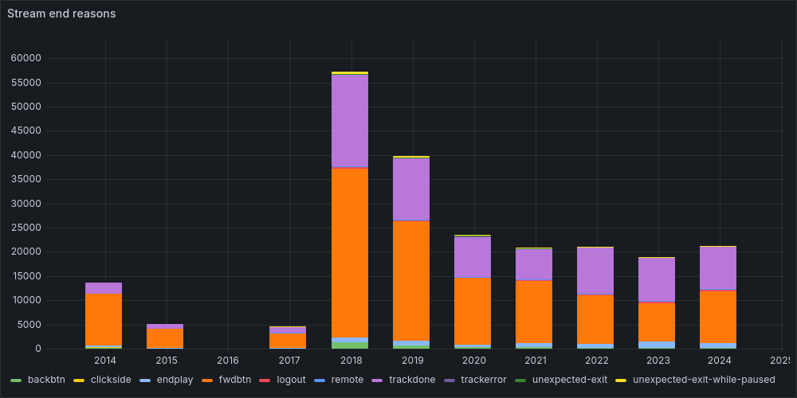
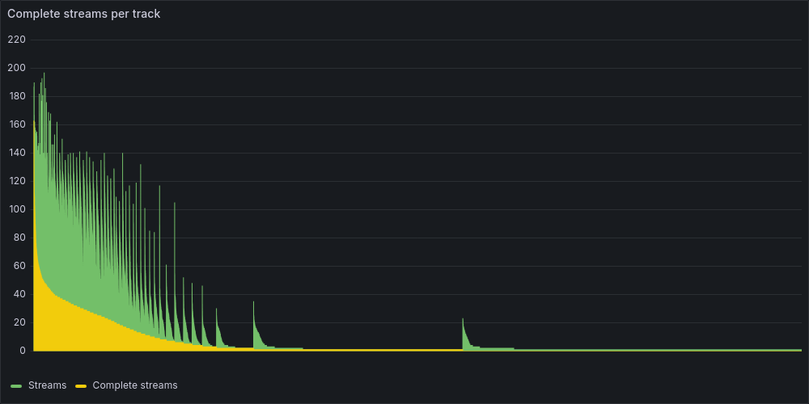
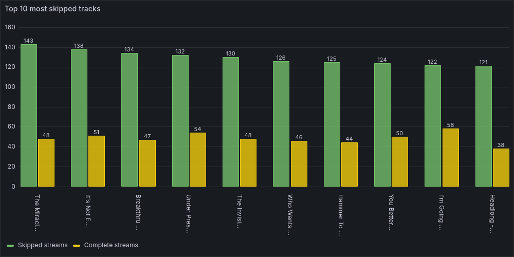
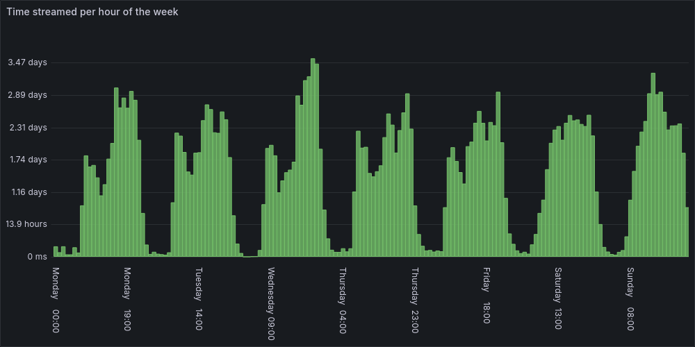
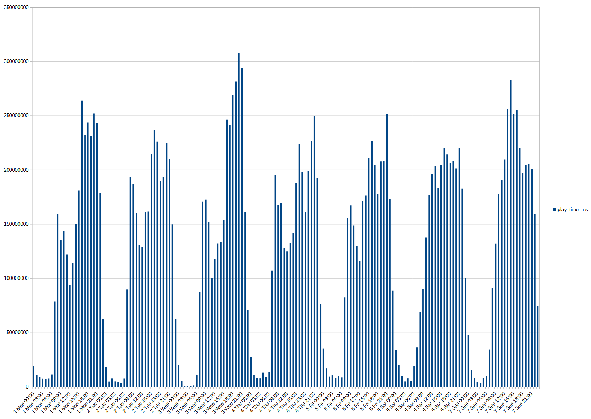
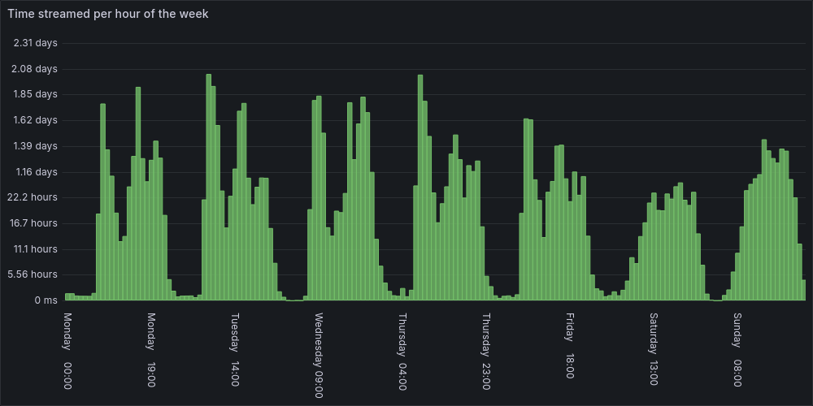
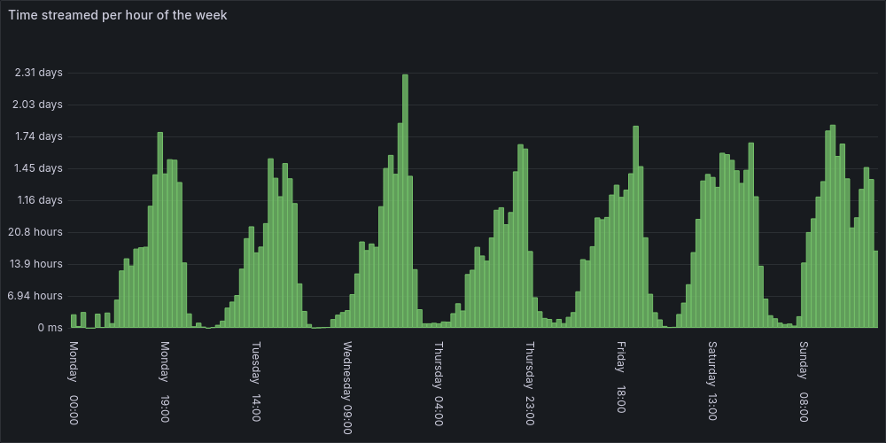
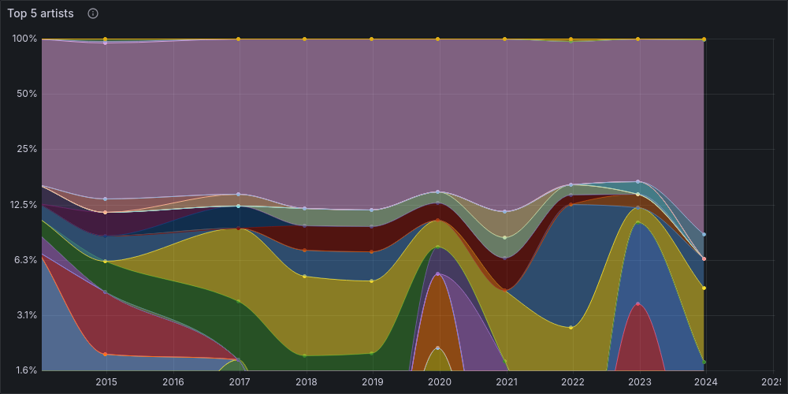

*This is part five of a series of posts on my Spotify extended streaming history that started with , and follows the fourth part, .*

## Visualising the data using CSVs and Libreoffice Calc

I dove down a bit of a rabbit hole when gathering and collating my streaming history data and its related metadata, but I did play around with analysing the data through various visualisation charts as I did so.

Back when I only had the [streaming history data](), I wrote a Python script that read in the history data and wrote out a JSON file containing summary stats such as:

- counters for all the different start and end reasons, platforms, countries and IP addresses
- a count of all `skipped` streams
- a count of all streams with `reason_end` of `trackdone`
- the total stream duration
- the total number of streams

The script also wrote a set of CSV files, including:

- one containing rows of data for the tracks I'd streamed, including URI, track name, artist name, album name, total duration streamed, stream count and complete stream count.
- one containing the albums I'd streamed, including album name, artist name, the total number of tracks played and total duration streamed.
- one containing the artists I'd streamed, including artist name, play count, complete play count, total duration streamed
- one containing stream count bucketed by hour or by hour-of-week, depending on a flag I passed when running the script.

  As I wrote this one I realised that some streams would have part of their playtime in one bucket and part in another (at worst, I think there were some podcast episodes that ran for between 3 and 4 hours), so I split their durations proportionally between the relevant buckets. After doing that I found that there were still hour buckets that contained more than an hour of streams, which led me to discover [more timestamp weirdness]().

I'd then open the CSV files in [Libreoffice](https://www.libreoffice.org/) Calc to view them as a spreadsheet, sort by the different columns, and generate bar charts of the data. This worked well for an initial exploration, but I got tired of juggling different CSV files and having to convert them to ODS files to save the graphs, not to mention having to extend the script to support different transformations of the input data.

## Trying InfluxDB

At that point, I decided that I'd benefit from putting the data into a database so that I could run a wider variety of queries more easily. Since the data consists of a set of timestamped stream objects, I thought that a time series database would be a natural fit. I've mostly used them for metrics collection, so Prometheus is familiar, but ingesting the data seemed like it would be a bit awkward, as Prometheus is more geared towards real-time metrics collection rather than ingesting historical data.

I decided to try out [InfluxDB](https://www.influxdata.com/) instead, as it was another time series DB that I'd heard of. I ran InfluxDB OSS v2.x from a Docker image using a [Podman Desktop](https://podman-desktop.io/) `compose.yml` file: it was pretty easy to get started, and its built-in GUI's support for various visualisations was very handy.

However, I got stuck trying to replicate my stream count by hour-of-week bar chart: one problem was that the GUI doesn't support bar charts unless the X axis is time (as in timestamps, things like day-of-week don't count), but I couldn't figure out how to produce the correct output data anyway. I did also run into [this issue](https://github.com/influxdata/influxdb/issues/24127), which was very annoying, and working around it made my queries significantly slower.

I'm sure part of it was a lack of familiarity with the Flux query language, and my experience with other NoSQL databases suggests that maybe I'd have been better off pre-processing the data and storing it in multiple buckets that were designed with the queries I'd be making in mind, but at that point I was still experimenting with what queries I wanted to run, so that felt like putting the cart before the horse.

## Switching to PostgreSQL and Grafana

After a few evenings of trying to make headway, I mostly gave up on using InfluxDB and decided to try a combination of [PostgreSQL](https://www.postgresql.org/) and [Grafana](https://grafana.com/) instead. I've got a fair bit of experience with both so was confident that I could make them do what I wanted. Again, I used Podman Desktop with a `compose.yml` file to define and run the two services.

With PostgresSQL, I dumped all the data I'd collected and collated into the DB pretty much unchanged, with most Python scripts' JSON output going into its own SQL table (the exception was the Spotify tracks metadata, which was split across separate tables for tracks, albums, artists and track artists). I didn't create indexes until I started to write more complex SQL queries joining different tables, at which point they noticeably improved performance.

The Python script I wrote to dump the data into the DB would create the tables and indexes if they didn't already exist, then truncate the tables and insert the data. That was quick enough and easier than trying to avoid duplicates without truncation when re-running the script.

I spent a lot of time playing around with Grafana, creating a dashboard and trying out all sorts of visualisations. The hardest part was definitely figuring out what I wanted to see, and how to display the data without it being overwhelmingly noisy. I ended up with 33 panels across 6 sections: time, streams, tracks, artists & albums, tags and acoustic properties. The panels were a mix of time series charts, bar charts, gauges and stat panels. I'm not going to list or show them all, but there were a few that stood out as more interesting or that took more work than the others.

### Stream end reasons



The SQL query for that graph is:

```sql
select $__timeGroupAlias(timestamp, $__interval),
    reason_end as metric,
    count(*)
  from spotify_streams where $__timeFilter(timestamp)
    and reason_end not in
      ('', 'appload', 'clickrow', 'playbtn', 'popup', 'uriopen', 'unknown')
  group by time, reason_end
  order by time;
```

The expressions beginning `$__` are [Grafana macros](https://grafana.com/docs/grafana/latest/datasources/postgres/#macros) that supply the relevant SQL snippets for the current time range selected in the Grafana GUI. Some end reasons are filtered out because they only appeared in the data for 2014 and 2015 and only for a relatively small number of streams (as detailed in [my first post]()), so are not really of much interest.

2014's stream count is lower than later years because I started using Spotify in August of that year, and I stopped using Spotify between March 2015 and November 2017, which explains why there are relatively few streams in those years.

2018's peak in the number of streams translates to 59 days of stream duration, which meant I was listening to music about a quarter of my waking hours that year! I think that's probably because I worked in an open-plan office at the time, while since 2020 I've worked from home, so there's less need to put on music to mask background noise and no need to keep me occupied during my commute. As for why there was a big drop in 2019, the only thing I can think of is that I got a promotion in the first half of that year, and as a result started spending a lot more of my working time on calls (so I couldn't be streaming music).

The breakdown of stream end reasons reveals something about my listening habits: I tend to listen to my music library on shuffle, skipping over tracks that don't fit my current mood. I attribute this to owning a second-generation iPod Shuffle in my mid-teens, so the way I listen to music developed within the constraint of only being able to listen to my whole library shuffled or in order, and I think I'd have gone crazy if I'd chosen the latter.

There are exceptions to that habit, of course: when I'm listening to music outside of my library it's either by listening through whole albums in order, or using one of Spotify's generated discovery playlists (which are a very mixed bag, e.g. I've got a lot of classical music in my library, but most classical music is insipid stuff, and I don't want to be thrown endless different recordings of the pieces I do like). When I find a new piece of music I do like, I tend to listen to it over and over until the part of my brain that has latched onto it lets go, so my most-streamed tracks are all unrelated tracks that grabbed me in that way. Fortunately I don't listen them to death, they just end up tracks in my library that I like better than most (though oddly I wouldn't necessarily call them my favourites).

Anyway, going back to how this relates to stream end reasons, playing my library on shuffle means skipping through a lot of tracks: another of my Grafana dashboard's panels tells me that while the mean length of a stream is 1.56 minutes, the mean length of a complete stream is 3.95 minutes, and my mean time before skipping a track is 13.8 seconds.

### Complete streams per track



This bar chart shows the number of complete streams per unique Spotify track, sorted by decreasing complete stream count and then by decreasing total stream count. The SQL query used was:

```sql
select count(*) as "Streams",
    count(*) filter (where reason_end = 'trackdone') as "Complete streams",
    track_name,
    track_uri
  from spotify_streams
  where $__timeFilter(timestamp)
  group by track_uri, track_name
  order by "Complete streams" desc, "Streams" desc;
```

There are two notable characteristics of this graph:

1. the number of complete streams experiences a roughly exponential decay
2. the number of streams shows something like a sawtooth exponential decay, or exponential decay within each set of tracks with the same number of complete streams.

Given that I expect to mostly stream a small core of tracks that I know I like, I'd expect some kind of Pareto-like distribution, so these characteristics aren't surprising. Looking at total streaming time (not just complete streams), 50% of streaming time is comprised of 5% of tracks, and 80% of streaming time is comprised of under 13% of tracks.

While unsurprising, I think it's still striking how concentrated my listening is, considering that the only cost to trying new music (from a catalog of over 100 million tracks) is however many seconds it takes to realise that I don't like what I'm listening to. Then again, [Sturgeon's law](https://en.wikipedia.org/wiki/Sturgeon%27s_law) applies, listening to a load of dreck in quick succession is unappealing.

I think that another factor is that (as I've already mentioned) Spotify's weekly recommendations often miss the mark. On the flip side, the tracks they add when you reach the end of a playlist often blend quite nicely. However, I'm not listening with intent at that point, so I rarely record that I like a track which plays then, so such tracks doesn't become part of my regularly-played library.

### Most skipped tracks



This is a bar chart showing the top 10 most skipped tracks with their skipped stream and complete stream counts. The SQL query used was:

```sql
select count(*) filter (where skipped = true
      or reason_end in
        ('backbtn', 'unknown', 'endplay', 'fwdbtn')) as "Skipped streams",
    count(*) filter (where reason_end = 'trackdone') as "Complete streams",
    track_name,
    track_uri
  from spotify_streams where $__timeFilter(timestamp)
  group by track_uri, track_name
  order by "Skipped streams" desc, "Complete streams" desc
  limit 10;
```

I've used a combination of `skipped` and `reason_end` filtering to identify skipped streams to work around [the apparent bug]() with `skipped` values not being recorded correctly between 2015-04-13 and 2022-10-16.

This chart shows the biggest surprise and weirdest result in all of my analysis: my top 10 most skipped tracks are all from [Queen's Greatest Hits album](https://en.wikipedia.org/wiki/Greatest_Hits_(Queen_album)), with the tracks being skipped about twice as often as they were played to completion. I don't know why that's the case, but it might be a combination of the following factors:

- The album will have been in my Spotify library for as long as I've used Spotify, so it's had as much opportunity to be played as it could have.
- As mentioned earlier, I tend to listen to my music on shuffle.
- Spotify's shuffle doesn't actually shuffle your current playlist and then play through the result: I'm pretty sure I once had the same track be played three times back-to-back without it being on repeat or any manual intervention, and besides that there's definitely some sort of bias I've noticed, because some of my library almost never comes up, while other tracks always seem to be played pretty early on into a shuffled play of my Liked Songs playlist.
- Queen's Greatest Hits is the UK's best-selling album, with over 7 million sales as of 2022: I checked and it's at number 23 in the 2024 charts (as of October). It was released in 1981! However, while I think it's a great album and I enjoy many of the tracks on it, I don't consider any of them to be among my favourites.

So maybe because the album is so popular, Spotify is more likely to surface its tracks while playing through my shuffled library, and so I'm more likely to hear them, but because they're more popular generally than specifically my favourites, I'm relatively likely to skip them when they do play.

The only alternative explanation that I can come up with is that at some point I had Spotify looping through the album but I wasn't paying attention and thought it was shuffling through my library, and I wasn't in the mood for Queen so just kept skipping them over and over until I eventually caught on. It's dumb enough to be true, but I'd rather believe my first idea.

### Streams per hour of the week



This shows how my time spent streaming was distributed across the days of the week, aggregated into hour-long buckets. The SQL query used was:

```sql
select sum, label
  from
    (select
        extract(isodow from timestamp) as day,
        extract(hour from timestamp) as hour,
        to_char(timestamp, 'Day HH24:00') as label,
        sum(ms_played) as sum
      from spotify_streams
      where $__timeFilter(timestamp)
      group by label, day, hour
      order by day, hour);
```

It's also worth noting that the SQL query above gives slightly inaccurate results, as it doesn't account for streams that start in one hour and end in another: `timestamp` is the stream's end time. The original script that produced the CSV buckets did take that into account, but the differences are pretty minor:



It's not a particularly useful chart, but I like it because it tells a story. It's actually a tale of two time periods, obscured by aggregating the data across the whole of my listening history. Here's the same chart split into those two time periods:




The upper chart shows the time period until the 1st of April 2020, and the lower chart shows the time period after that. They look quite different, and that's because that's when I shifted from working in an office to working from home (WFH).

- Pre-WFH, I took the bus into work during the week, and the 08:00 spike reflects the time spent listening on the bus to work. That bled over into the start of my work day as I dealt with admin, etc. before reaching my flow state. The low point during each weekday was at lunchtime, when I would be chatting to others instead of listening to music.

  After lunch, I'd be more likely to listen to music as I worked, but listening really jumped at 16:00 as I wrapped up my work day and caught the bus back home (actually, I expected that to bleed across more into 17:00 than it does). It then fell back down to a lower but variable level until it was time to wind down for the evening.

  There's a dip at 18:00 each day apart from Wednesday, but I'm not sure why: it seems a little early for dinner, but maybe it reflects time spent cooking (I usually listen to podcasts as I do so, which I've excluded from the dataset). That doesn't quite make sense, as I tend to batch cook, but maybe I've gotten better at doing it at the weekend since then.
- In the WFH era, I no longer commute, so there isn't a morning spike in listens during the week. Instead, they gradually rise to a plateau at around lunchtime as I get through my morning meetings and reach my flow state, and then rise again between 16:00 and 17:00, except for on Fridays.

  The afternoon rise happens much earlier on Fridays: by 13:00 I hit similar listening levels as at 16:00 on other days. That suggests that the rise in listening levels is due to needing a little something extra to pull myself through the remainder of the work day, and that need hits a bit earlier on a Friday afternoon.

  On all weekdays, my listening peaks in the evening: Wednesday's peak is significantly higher, but I don't have any ideas for why that is.
- Pre-WFH, my weekend listening patterns are much more symmetric than during the week, though Saturday's starts earlier and peaks in the early evening while Sunday's starts later but peaks mid-afternoon: probably because I was busy getting stuff done on Saturday without a soundtrack, while on Sunday I was more likely to lie in and then have a more relaxed day.
- In the WFH era the difference between my weekdays and weekends is less pronounced, but I still listen to more music on the weekend mornings and my listening peaks earlier in the afternoon than during the week. Sundays have become less symmetric, with a big dip in the early evening. I put that down to that being when I'm most likely to be batch-cooking meals for the week ahead, and so listening to podcasts during that time.

### Top artists



This is a graph of artists streamed over time, with the 5 artists with the most completely-streamed tracks each year present individually and the rest aggregated into an "Others" value (which is the purple area that takes up most of the ). The SQL query used was:

```sql
with metrics as
  (select $__timeGroup(timestamp, $__interval) as time,
      sa.name as metric,
      count(*) as total,
      dense_rank() over
        (partition by $__timeGroup(timestamp, $__interval)
          order by count(*) desc) as rank
    from spotify_streams ss
    join spotify_tracks st on ss.track_uri = st.spotify_uri
    join spotify_track_artists sta on sta.track_id = st.spotify_id
    join spotify_artists sa on sa.spotify_id = sta.artist_id
    where $__timeFilter(timestamp) and reason_end = 'trackdone'
    group by time, sa.spotify_id, metric
    order by time asc, total desc)
  select time, metric, total from metrics where rank <= 5
  union all
  select time, 'Others', sum(total) from metrics where rank > 5
    group by time
    order by time asc;
```

This is one of the most complicated visualisations on my dashboards, together with similar graphs for tracks and albums, and I struggled to display anything meaningful. A few display choices helped with that:

- The graph stacks series and the display is normalised to 100% so that years with more streams don't cause years with fewer streams to be squashed into being unreadable, and to show how the proportion of total streams for a given artist changed over time.
- Shading the area under each line helps to make the visualisation of each artist clearer.
- A log scale is used so that the top 5 artists are given more space: although they're proportionally significant as individual artists, they only represent a minority of total streams.
- The graph is explicitly restricted to a maximum of 12 data points because otherwise the result is very slow to generate and is way too noisy to be readable. The stream end reasons chart shown earlier was also restricted to 12 data points to make it more readable.
- The legend is hidden because many artists drop in and out of the top 5, with 26 artists appearing across my streaming history, so the legend takes up a lot of space and there are some very similar colours used for different artists. Hiding the legend gives the graph more space, and it's easier to see what artist a given area of the graph corresponds to by hovering over that area than it would be to use the legend if it were displayed.

## Value for money

One of the questions I had was how Spotify's value for money compared to buying the music I liked. To that end, I created a CSV file of Spotify payment amounts and the dates on which I paid them, and fed it into my database so that I could see how much I'd spent on Spotify over time. That told me I've paid:

- 0.4p per minute streamed
- 0.6p per stream
- 1.8p per complete stream
- 1.1p per stream of a track that I don't own
- 3p per complete stream of a track that I don't own
- 9.7p per track streamed
- 17.5p per track completely streamed
- 22p per unowned track completely streamed

The mean, median and mode number of complete streams per owned track are 17.8, 15 and 1 respectively, while for unowned tracks they're 7.4, 1 and 1 respectively. I've completely streamed 938 tracks that I don't own more than 18 times each. It would have been cheaper to just buy those tracks (as the cost of Spotify works out to £1.60 for each of those tracks), but I wouldn't have come across many of those tracks, not to mention all the other music I was able to listen to and decided I didn't like as much.

Given those numbers, Spotify seems like relatively good value for money, but they also provide a personal reflection of how my own listening habits feed into the problem of all but the most popular artists making essentially no money off Spotify. My stats also tell me that the average popularity of tracks I've listened to is 22 (out of 100), with a standard deviation of 21.5 (i.e. the music I listen to is relatively unpopular), so my streams probably account for a smaller than average slice of Spotify's total streams, which are used to divvy up their pot of revenues that are distributed to artists.

Personally, while Spotify is hardly a perfect fit for me, buying music wouldn't really work as an alternative, as that wouldn't provide the ability to discover new music or to dip into music that I wasn't really interested in enough to buy but had caught my ear for whatever reason. I suppose that the free tier could be enough to support that kind of usage, but I find advertisements too annoying to put up with compared to the cost of a subscription, and the sheer convenience of having almost my whole library on Spotify and accessible on any device while also supporting syncing of files for those tracks that I own that aren't on Spotify is pretty attractive.

That said, I'm shifting towards a model in which I use Spotify to listen to music, but also support the artists whose music I like by buying it. I used to buy CDs before I settled on using Spotify, but since then I've managed to lose a few of those discs, and thinking I had them as physical backups I didn't take care of their FLAC rips and lost them too. I've still got an external CD/DVD/Blu-ray drive that I took from an old laptop, but I now feel like I'm less likely to lose the music I own if I know it only exists digitally and therefore include it in backups, so more recently I've mostly been buying music on Bandcamp and from 7digital. It is a bit annoying how much more expensive FLAC downloads are compared to MP3s on 7digital though.

## Miscellaneous oddities

There were two oddities that I discovered while analysing my streaming history combined with the data obtained from Spotify's web API that I want to quickly mention here.

### `trackdone` stream duration not matching track duration

I noticed that the duration of a `trackdone` does not always match the duration of the track being streamed:

| Filter                                                  | Sum of `ms_played` |
| ------------------------------------------------------- | ------------------ |
| `reason_end = 'trackdone'`                              | 18679692394        |
| `reason_end = 'trackdone' and duration_ms <> ms_played` | 980322737          |
| `reason_end = 'trackdone' and duration_ms > ms_played`  | 552735720          |
| `reason_end = 'trackdone' and duration_ms < ms_played`  | 427587017          |
| `ms_played = duration_ms`                               | 17780634867        |
| `ms_played = duration_ms and reason_end <> 'trackdone'` | 81265210           |

That's a difference of up to 5%, or 10 days! Maybe the durations from Spotify's web APIs are not always accurate?

I had a look at the `reason_end` values for when the stream duration equals the track duration using the SQL query:

```sql
select reason_end, count(*) from spotify_streams ss
  join spotify_tracks st on ss.track_uri = st.spotify_uri
  where ms_played = duration_ms
  group by reason_end;
```

and the results were:

| `reason_end` | Count |
| ------------ | ----- |
| `endplay`    | 348   |
| `fwdbtn`     | 9     |
| `logout`     | 1     |
| `trackdone`  | 74837 |

I don't know what the difference in meaning is between `trackdone` and `endplay`, but I think the `fwdbtn` and `logout` appearances can be explained by coincidental timing.

### Nonsensical Spotify album release dates

My Spotify albums have varying release date precisions:

| Release date precision | Album count |
| ---------------------- | ----------- |
| `month`                | 20          |
| `year`                 | 690         |
| `day`                  | 7648        |

The first thing is that I think it's unexpected that there are so many (or really any) albums for which the release day or even month is unknown: I'm not listening to 19th century recordings the origins of which are lost to history, this stuff should be known!

The second thing is that even when the release date precision is `day`, the dates themselves are often nonsense: there are 8 albums that have release dates after the date on which I first streamed them, and 2912 albums that I've apparently listened to on their release day, which is unbelievable.

As a result, I ended up abandoning my attempt to measure how old my music tastes are, and how long it takes me to discover albums. It might be possible to use MusicBrainz's release dates, but then I'd have to map Spotify albums to MusicBrainz releases, which seems like a can of worms that I'd rather leave unopened.

## Wrapping up

This didn't turn out as I expected when I started poking around my streaming history data: I had no idea that it would grow arms and legs and occupy my attention for a few weeks.

I definitely got way more into the weeds of combining datasets than expected, and dove down a bit of a performance rabbit hole while doing that (though that was predictable from the moment I found the initial performance to be lacking).

The actual analysis part ended up being more of an afterthought, though I did get some useful insights from it, and it was cool to see my listening habits and how they've changed over time emerge from the data. There were a few things that I noted as "hmm, that's weird, maybe I'll come back to that" and never did, and several mysteries that I did investigate but couldn't find satisfactory explanations for.

Spotify restricting their API mere days before I looked into it was very annoying, though I did get 90% stream coverage of acoustic metadata using AcousticBrainz. I didn't end up covering it in this post as while the stats were interesting, I couldn't come up with a good way to cover them. The tag metadata that I got from MusicBrainz showed very little variation over time, and my most common genres and non-genre tags turned out to be very predictable, which is why I didn't mention them in this post.

I didn't consider writing about any of this until I thought I was done with my analysis, and I certainly didn't think I'd have well over 17,000 words to say about it. I started with a set of jumbled and incomplete "lab notes" that I'd been writing as I went along, jotting down stuff I thought I might want to go back to, and when editing them into a more coherent narrative I kept realising I'd missed something, or there was a gap that needed filling, or the editing would prompt a new idea for more investigation, optimisation or analysis. I wouldn't be surprised if nobody ever reads this, but in that regard writing everything out was still very useful. I suppose it's a little like how you don't know you know something until you have explained it to someone else.

It's also worth noting that I did this without any research into whether anyone had done anything similar, besides my mentions of stats.fm and Last.fm, but I wouldn't be surprised if all the answers to my questions are already out there. There are probably several GitHub repositories containing scripts like mine (I'll probably share mine but haven't gotten around to it yet). I enjoyed trying to figure things out myself though, and in the end it was more about the journey than the destination. This kind of data wrangling isn't something I do much of, so it was an interesting change and I'd be up for doing more of it in the future.
