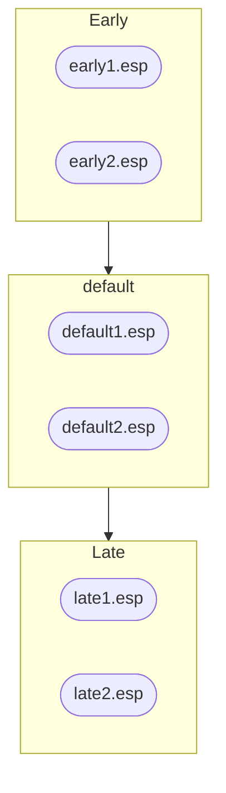
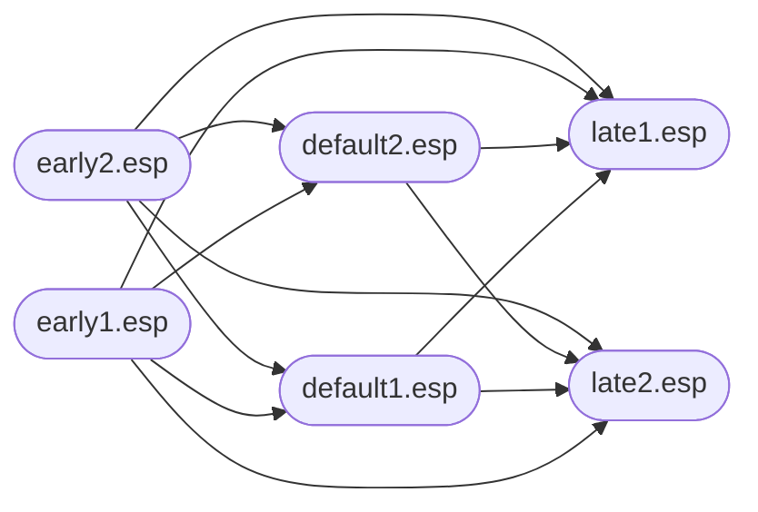
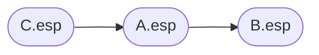
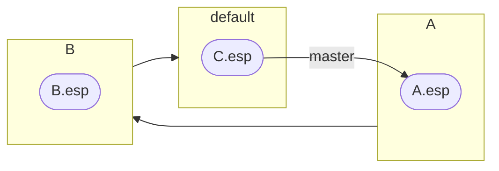
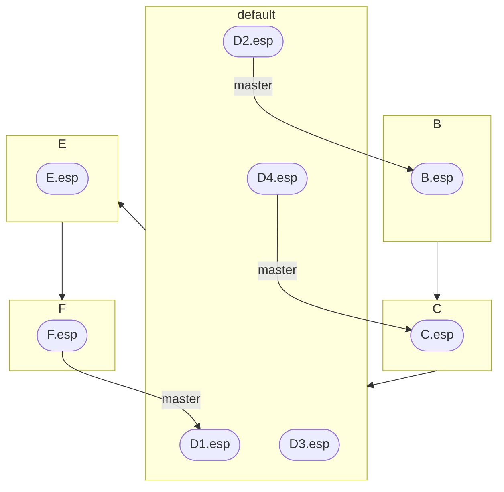
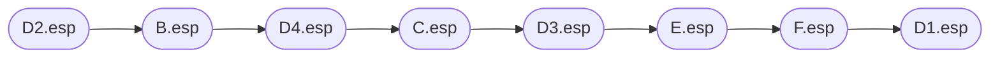
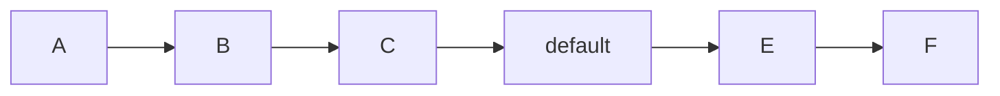
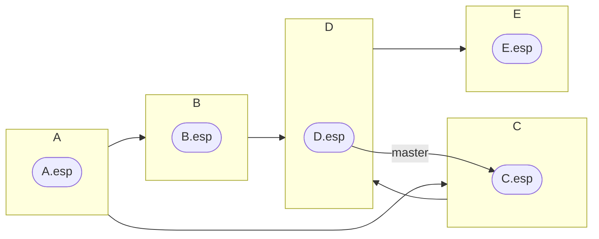
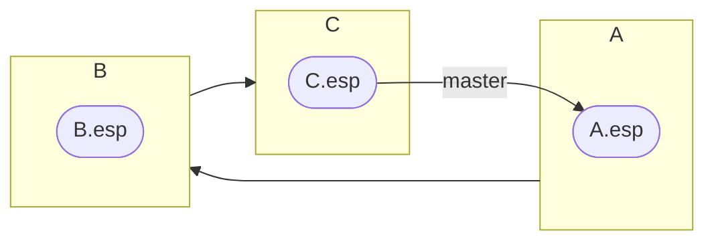
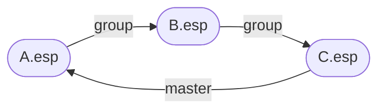

[LOOT](https://loot.github.io/) is a utility that helps people use game mods for Bethesda's Elder Scrolls and Fallout games. Mods for these games use plugin files to make changes to game data, and LOOT's main feature is sorting the order in which these plugins are loaded by the game to help avoid compatibility issues.

It's been a couple of years since I overhauled [the approach to tie-breaking during sorting](), and at the end of that post I mentioned that I had started improving the approach to groups. Those changes then sat untouched for almost two years, until a user filed a bug report about a cyclic interaction error involving groups, and found that my changes (after I rebased them on the latest `master` branch commit) resolved that issue.

I hadn't merged the changes yet because they had what seemed like a significant performance hit, though in hindsight my test setup and measurement approach may have been distorting the impact. In any case, I spent some time over a few days making some general [sorting optimisations](), tidied up my group changes a little, and then merged them. The changes haven't been released yet, but you can see the commits in [this comparison view](https://github.com/loot/libloot/compare/aeca443b9aabfb66f2433a2337f52ef1dd14d289...794e796de829782f07e373021e944bb9e0d1a421).

Since the change is a significant quality-of-life improvement for some users, it seemed worth writing about. This is my attempt to explain the old and new approaches to the groups part of load order sorting.

### A brief primer on sorting by groups

A few definitions to start with:

- A group is a named set of plugins
- A plugin is a member of one group only
- If a plugin's metadata does not explicitly define its group membership, it is a member of the `default` group
- Each group can load after zero or more other groups, so the set of groups forms a directed graph (which must be acyclic for sorting to succeed).

To reuse a couple of diagrams from my [2023 post](), this means you can end up with a group graph that looks like this:



which, if fully enforced, would produce a plugin graph that looks like this:



(I'm going to start using graph terminology, so in case you're unfamiliar: each line on the graph above represents an *edge* going out from one *tail vertex* and into a *head vertex*, with the arrows pointing towards the head vertex.)

You typically don't want to apply all of the edges that are derived from group metadata (a.k.a. group edges), because some plugins will have other, more explicit load order requirements that may conflict, for example:

- Some plugins may be hardcoded to load in specific positions
- Plugin A may have a plugin B as a master, in which case A must load after B
- Plugin A may have requirement or "load after" metadata in LOOT's masterlist or userlist saying that it must load after another plugin B

The first two cases are enforced by the game, so naturally take precedence over group membership. In the third case, LOOT gives precedence to more specific metadata, so metadata saying that one specific plugin loads after another specific plugin takes precedence over their groups' ordering.

If you were to apply two conflicting edges, you'd end up with a cycle, making sorting the graph impossible. Almost all of the complexity of dealing with groups during sorting is down to trying to identify when an edge should be skipped to avoid a cycle, while preserving the effect of groups as much as possible.

If you've got two edges that cannot both be added without causing a cycle, then the first edge to be checked is the one that will get applied, while the other edge will be ignored (assuming you're checking for potential cycles). For example, with the graph:


The edge from `C.esp` to `A.esp` may as well be set in stone, so you can either to choose to end up with:



or:


and in this case there's not really any reason to prefer one over the other.

The existence of the `default` group introduces a potential reason to prefer one group edge over another. Since everything belongs to the default group by default, membership of that group is less significant than membership of any other group, so if you've got:



then you want that to de-prioritise `C.esp`'s membership of the default group, and so produce:


As a more complex example of the same idea, consider:



That should produce:



so that the plugins in the non-default groups have their memberships take precedence over those of the plugins in the default group.

The order in which edges are checked is largely down to the order in which vertices get added to the graph, so the order in which that's done can have a significant impact on the load order that sorting produces.


### The old approach to adding group edges

The approach used for applying plugins' groups as part of sorting in libloot 0.24.5 was largely unchanged since groups were introduced in 2018, though some of the calculations were made lazier and the distinction between user group metadata and masterlist group metadata was introduced at the start of 2023.

The approach was a mess, and I think I started hating it since before I finished the initial implementation, because I started with quite a simple idea and then kept finding ways in which it wouldn't work and ended up bodging together something that was almost, but not quite, entirely unlike my original vision. Worse, it seemed to work, at least until you tried a combination of metadata that was even slightly self-contradictory. With that in mind, I'm going to try to attempt to explain it: it's not difficult to follow what it did, but even I struggle to answer why it did some of those things.

The first thing that happens is the creation of a groups map, combining all the masterlist and userlist group definitions. The resulting map is a simple mapping of group names to `Group` objects, where the `Group` objects contain the combined `after` entries from the masterlist and userlist for that group.

Next a map of groups to their predecessors is created, with the predecessors being ordered closest first. To help explain it, here's an example of a simple group graph:



The predecessor groups map for this would look like:

```json
{
   "A": [],
   "B": ["A"],
   "C": ["B", "A"],
   "default": ["C", "B", "A"],
   "E": ["default", "C", "B", "A"],
   "F": ["E", "default", "C", "B", "A"]
}
```

It's more complicated in reality, as sorting also tracks if any user metadata is involved, but that information is only used when reporting cycles, so I'm glossing over it.

This map is then combined with plugin metadata to produce a map of predecessor group plugins. For example, if plugins `A1.esp` and `A2.esp` belonged to group A, `E.esp` belonged to group E, and `default.esp` had no group metadata, then the resulting map would be:

```json
{
   "A": [],
   "B": ["A1.esp", "A2.esp"],
   "C": ["A1.esp", "A2.esp"],
   "default": ["A1.esp", "A2.esp"],
   "E": ["default.esp", "A1.esp", "A2.esp"],
   "F": ["E.esp", "default.esp", "A1.esp", "A2.esp"]
}
```

It's worth noting that each group's plugins are sorted lexicographically by their name before being added to the map, to ensure a consistent order between runs.

So far this is pretty reasonable, but unfortunately it seems that I lost the plot at this point. Two containers are needed for the next bit:

- one sequence of pairs of vertices, representing prospective edges to be added
- one map of group names to sets of plugin names, representing plugins that should be ignored per group

Sorting then starts to loop over each vertex in the plugin graph in the order they were added to the graph (which is lexicographical by their plugin names). For each plugin, it uses the newly-created map to look up the predecessor group plugins for the group the current plugin is in, and for each of those plugins, it checks if a path already exists going from the current plugin to the current predecessor plugin:

- If there is no path, a prospective edge going from the current predecessor plugin to the current plugin is recorded (but the edge is not yet added).
- If there is a path, then:
   - If the current plugin is a master file and the predecessor plugin is not, then it just moves on to the next predecessor plugin. (This is vestigial, since LOOT has sorted masters and non-masters in separate graphs for a couple of years.)
   - If neither the current plugin nor predecessor plugin are in the default group, then it just moves on to the next predecessor plugin.
   - Otherwise, the plugin that's in the default group (if both are, the current plugin) is marked as one to ignore:

      1. The groups graph is searched to find all the groups in all the paths between the current plugin's group and the current predecessor plugin's group.
      2. For each of those groups discovered, the plugin to ignore is added to the map of plugins to ignore per group

Once all the plugins in the plugin graph have been looped over, the prospective edges that have been recorded are looped over. Each edge is added to the graph only if its tail plugin doesn't appear in the head plugin's group's "plugins to ignore" set, and the head plugin doesn't appear in the tail plugin's group's "plugins to ignore" set.

The order in which plugins and their predecessors are processed means that the only "big picture" prioritisation of group edges (aside from default group plugins being ignored) is that closer predecessors are more likely to have their edges added, which probably biases cycle avoidance in favour of later-loading groups.

That can handle graphs like this:



which produces this:


and many other cases, but the simplest case I've found where it fails is one from earlier:



which causes a cycle:



### The new approach to adding group edges

The "big idea" with the new approach was to try to enforce the groups graph on the plugin graph as much as possible, leading the processing from the groups rather than the plugins. One of the big problems with the old approach was how scattershot its application of groups was, because it looped over plugins, looking at their groups, rather than looping over groups, looking at their plugins. That meant you could be adding edges to one group for one plugin, and then the next is dealing with a group that's in a completely different part of the groups graph, with no coherence to how they were applied. It made building a mental model of the process very difficult, so it seemed unpredictable. So, here's the new approach.

First a groups graph is created, using all the groups metadata from the masterlist and userlist. When adding groups to the graph, masterlist groups are added first, then userlist groups, both in lexicographical order of their names. For each set of groups, the group vertices are added first, then each group's "after" metadata is used to add edges, with each group's "after" entries being sorted lexicographically first.

I don't think that the order of group `after` metadata is important for sorting, but it does affect the paths found by libloot's `DatabaseInterface::GetGroupsPath()` function. The order that the group vertices are added in does affect sorting behaviour, so it's important that it's consistent between runs, and ordering by group source then name seems like the least surprising option, though I am torn between using names and the order they're defined in their source metadata file.

(The reason I don't think the after metadata order matters is because edges are added while processing each edge's head group, but they're accessed from their tail group, so the only time you'd consecutively process two edges from the same "after" metadata object is when they both go from the same group, in which case they're identical, so the order doesn't matter.)

Once the groups graph is built, it's used together with the plugin graph to create a map of group names to sequences of plugin names. I don't *think* the order of plugin names matters, but it's in the order that plugins were added to the plugins graph, which is also consistent between runs.

(The reason why I don't think the order of plugin names matters is that it would only matter if, given a
set of source plugins and a set of target plugins with any acyclic combination of edges between them, when you adding edges from the source plugins to the target plugins, it's possible to have a choice of edges to skip to avoid a cycle. I can't think of any situation where that's true.)

The group graph vertices are then retrieved, and stable-sorted to move root vertices (i.e. groups that don't load after any others) first. If there are multiple root vertices, the roots are sorted in descending order of their longest path lengths, which are calculated by running a depth-first traversal of the graph from each of those root vertices, keeping count of the path length while doing so.

The sorted group vertices are then looped over in that sorted order, and another depth-first traversal is run from each vertex. As this walks the groups graph:

- If it encounters an edge going to a group that it's not encountered before, it:
   1. adds that edge to a sequence that represents the current path through the graph, along with the plugins in that edge's tail group. However, if the tail group is the `default` group then its plugins are not recorded.
   2. gets the plugins that are in the edge's head group.
   3. loops over the tail groups in the edge sequence (from earliest to most recent), and for each plugin in that tail group and each plugin in the head group, adds an edge to the plugin graph going from the tail group plugin to the head group plugin if that edge doesn't cause a cycle (and if a path between them in that direction is not already cached).
- Once it's done processing the subgraph that an edge leads to, it removes that edge from the edge sequence.

There's also an optimisation that keeps track of which vertices have been fully processed, and there's also tracking of whether user metadata was involved in an edge being added, but that's only used in case of cycles (which this approach should completely avoid).

Finally, one more depth-first traversal is run from the `default` group's vertex, doing the same as the others but this time not ignoring the `default` group's plugins as tail group plugins.

By processing the root vertices with the longest paths first, the idea is to walk as much of the groups graph in one go as possible, so that groups are applied in (roughly, accounting for branching) the order that they're laid out in the graph, aside from the default group.

This approach is able to sort a much wider range of group metadata combinations, where the old approach often caused cycles or skipped edges that it could have added: I had eight test cases documenting different scenarios in which sorting didn't work as expected, and the new approach fixed them to give the outcome I'd expected, with no changes made targeting those cases specifically. I've also added more test cases to cover behaviour that wasn't even on my radar before, like processing root vertices in order of longest path.

That said, there are a couple of potential shortcomings with this approach:

- Ideally you'd only need to walk the graph from the root vertices and then the default group's vertex, but a standard breadth-first search doesn't revisit head vertices that it's already processed, so if you've got a situation like this:

   ```mermaid
   flowchart LR
      A --> B --> D --> E
      A --> C --> D
   ```

   then if you started with A, you might visit B, D, E, then go back to A and visit C, then see you'd already processed D, so C's plugins would have edges added to D's plugins, but not E's plugins.
- Although the root vertex with the longest path is processed first, that doesn't mean that the longest path is processed first: if there's a fork into longer and shorter paths that then rejoin, the shorter path might be taken first.

However, improving on those points would introduce significantly more complexity and I doubt they're worth it. Maybe I'll revisit it once this new implementation has been out in the wild for a while and I've had a chance to collect some more feedback, but for now it seems to be a very successful overhaul. Fingers crossed that I don't have to eat those words! 🤞
