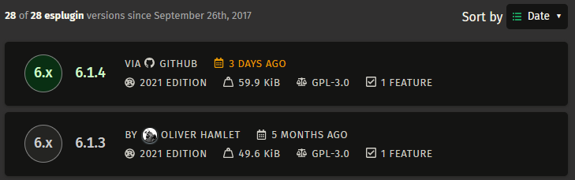

Since the recent [successful](https://www.aikido.dev/blog/we-got-lucky-the-supply-chain-disaster-that-almost-happened) [attacks](https://www.aikido.dev/blog/s1ngularity-nx-attackers-strike-again) on very popular NPM packages[^npm-attack], I've been making some changes to help protect my Rust codebases against supply chain attacks.

[^npm-attack]: I expect that will be an evergreen opening phrase...

## Using Trusted Publishing

Until earlier this year I published crates to crates.io from my PC, authenticating using API tokens. I've now configured all of my crates to use [crates.io's implementation](https://crates.io/docs/trusted-publishing) of [Trusted Publishers](https://repos.openssf.org/trusted-publishers-for-all-package-repositories.html), which was [announced](https://blog.rust-lang.org/2025/07/11/crates-io-development-update-2025-07/#trusted-publishing) in July. I've got my CI set up so that pushing a Git tag of a certain format triggers a release workflow that includes a publish job.

crates.io optionally restricts publishing to a configured GitHub environment, and I've used that for all of my crates. The repositories that sit under my GitHub account have no additional restrictions imposed by the environment, but those that sit under a GitHub organisation require me to manually approve the publish job, since there are other people in the org who can push changes but who probably shouldn't be publishing releases.

### Why?

There are several reasons to prefer publishing from CI over publishing locally, but Trusted Publishing significantly improves the handling of access tokens, so that they are:

- automatically created and revoked
- always short-lived, with a 30-minute lifetime
- always scoped to only allow publishing updates to one or more specific crates
- only obtainable by a specific GitHub Actions workflow in a specific repository, and optionally a specific GitHub environment

While I'm not aware of any compromises of crates.io packages due to stolen access tokens, it's happened in other ecosystems, and there's no reason why crates.io tokens are any less vulnerable.

In fact, because **crates.io doesn't support multi-factor authentication for publishing**, the token is all an attacker needs, and you wouldn't necessarily know they've got it until you get an email notifying you that "you" have published a new crate or version or made some other change.

Of course, using Trusted Publishing opens up new attack vectors: you're relying on the security of GitHub's infrastructure, of any Actions that you use in your publishing workflow, and access control on writing to your repository and on running its publishing workflow. I think that it's *possible* to use a local publishing workflow that's at less risk of compromise, but Trusted Publishing makes it easy to improve upon what I was actually doing.

### Why didn't I publish from CI until now?

I didn't want to give GitHub Actions the access tokens to publish releases on my behalf, as that would mean I'd need to store and manage the tokens in GitHub, and it would make it look like the releases were coming from me.

Trusted Publishing removes the need to manage tokens, and when a version is published using it, crates.io shows that it came from GitHub, not you. It even links back to the GitHub Actions run that performed the publish. Here's what that looks like:



### Limitations

You can't currently publish a crate's first version using Trusted Publishing. It's not an inherent limitation, just something that hasn't been implemented yet, but until it's lifted  I'll need to generate a new access token whenever I need to publish a new crate.

I see that as more of a user experience issue than a security issue, because you can create a token that is only valid for one day, and that is limited to only creating a crate with a specific name, making it practically useless if stolen.

## Reviewing dependency updates

I've used Dependabot to keep my Rust dependencies up to date for several years, and when processing its pull requests,  I generally just skimmed the changelog and then merged the pull request if the CI build had passed. However, since May I've started to take a more considered approach.

### Before looking at the code

I've generally tried to keep my direct dependencies up to date, as it's easier to review small frequent updates than large infrequent updates. However, I'm starting to skipping releases that don't make any changes that I care about, because:

- it can reduce churn (and therefore cumulative review effort)
- if the release *is* compromised, then I've avoided being affected without having to do anything!

Another thing I'm coming back around to is leaving updates for a while. It's my norm when not using a tool like Dependabot, but that's more due to not knowing when an update becomes available than general inclination. I don't *really* need to use the latest version as soon as it's released, and waiting a week is probably plenty of time for any issues to be noticed and resolved. Issues aren't limited to compromises either: I know how easy it is for significant bugs to slip through.

Dependabot has a [`cooldown`](https://docs.github.com/en/code-security/dependabot/working-with-dependabot/dependabot-options-reference#cooldown-) config parameter, but it also affects security updates, which I don't want delayed, so instead I just ignore Dependabot's pull requests for a while.

### Viewing the diff

I've recently come across [diff.rs](https://diff.rs/), which displays the contents of crates downloaded from crates.io and can display the diff between two different versions of a crate (or even different versions of different crates). I'm now using it instead of the compare view that Dependabot links to: more on why [later](#trusting-dependabots-diffs).

It would be good if diff.rs (or something like it) was adopted by the Rust project (like docs.rs was), because although it's open-source and does all its processing locally in your browser, you do need to trust that it's doing what it says it's doing, or build it from source yourself. If it was an official tool then crates.io could also link to it from a crate's page to make viewing the diffs a little easier.

### Review criteria

When I read the diff, I'm not performing a normal code review, I'm just checking for signs of potentially malicious changes, asking questions like:

- is there anything obviously harmful going on?
- does anything look obfuscated?
- does anything look out of place? E.g. why is there a network request in this file parser?

Some specific types of changes that I look out for are:

- Build scripts, as if malicious they can be used to target developers
- New or updated dependency specifications, as they can be used to sneak a malicious package into your dependency tree. If a new or updated dependency *is* introduced then I'll also need to review that.
- The `unsafe` keyword, as it might be used to do something underhanded. I doubt I'd spot anything clever, so this is more of an example of something that might look out of place or obfuscated.

## Reviewing prospective dependencies

I've generally just trusted very popular packages (i.e. those with 10s of millions of recent downloads), and only taken a look through the code of less popular packages. I think that's a reasonable balance - the odds of getting unlucky with a very popular package must be tiny, and I've definitely tried out packages and then decided not to use them, so doing the review before making that choice could be a lot of wasted effort.

What I *have* decided to change is how I get the code that I'll be reviewing.

In the past I've gone to the repository that's linked to on a crate's crates.io page (e.g. [esplugin's](https://crates.io/crates/esplugin)), but there's [no guarantee](https://lawngno.me/blog/2024/06/10/divine-provenance.html) that the code published to crates.io exists in the linked repository. Even if the crate version you're interested in was published using Trusted Publishing, if it has a build script then that [may modify](https://blog.weiznich.de/blog/cargo-safe-publish/#cargo-allowing-build-scripts-to-overwrite-the-generated-package) what gets uploaded.

Another approach would be to add the dependency to your project, but not use it, and then use Cargo to download it so that you can review it locally. However, you need to be careful to run `cargo fetch` (or `cargo vendor`) to **download but not build the crate**, instead of other commands such as `cargo check`, `cargo build` or `cargo test`. If you don't do that, then Cargo will execute code that you haven't yet reviewed! You also need to make sure that nothing automatically runs the build script when you open the code in your preferred IDE or text editor: for example, rust-analyzer will run build scripts by default.

The best approach I've found is to use [diff.rs](https://diff.rs/), or to go to the dependency's [docs.rs](https://docs.rs/) page and then navigate to the source view there. For example, [here](https://docs.rs/crate/esplugin/6.1.4/source/) is the source of v6.1.4 of my esplugin crate. I find diff.rs a little easier to use because its full directory tree is always visible as you move between directories.

The main downsides of using diff.rs or docs.rs are that they're online solutions, and they restrict you to using their built-in file browsers, which don't support things like using multiple panes to view different parts of the codebase at the same time. On the other hand, there's no danger of the code being run accidentally.

I think it would be great if you could run something like `cargo fetch <crate name>[@version] [destination folder]` to download and extract a crate tarball without adding it as a dependency, but another option could be to have a download button on crates.io that would allow you to download a crate version's tarball.

I'd also like to have the ability to disable or sandbox build scripts by default, to mitigate the impact of running a malicious (or just buggy) script, but I don't know how either feature could be implemented in a way that effectively balances security and usability.

## Tracking dependency reviews using cargo-vet

Reviewing dependencies is a lot of work, and I've found that across several repositories it's easy to lose track of what I've already done. There are two tools that I'm aware of that can help:

- [cargo-crev](https://crates.io/crates/cargo-crev)
- [cargo-vet](https://crates.io/crates/cargo-vet)

Unfortunately cargo-crev fails to build for me on Windows due to an OpenSSL dependency that wants Perl to be installed, and prebuilt Windows binaries aren't available. cargo-vet does build, so that's what I've ended up using.

When you run `cargo vet init` on your codebase, it records the crates in your current dependency tree as exempt. If you add a new dependency or update an existing dependency (including transitive dependencies), then `cargo vet` will complain unless you do one of the following:

- mark that dependency version as exempt
- mark that combination of dependency and publisher as trusted - this lasts for a year by default
- perform and record an audit, which can either be for a specific version or for the delta between two versions

You can provide notes to be recorded for each of those options, and publishers can also be trusted across all the crates that they publish.

You can also import audits that are published online, and by default cargo-vet can suggest importing from sources that include Google and Mozilla. You can also see who those third-parties have trusted, though there's no import of trust, and audits are not imported transitively.

When it comes to performing audits, cargo-vet provides commands for inspecting and diffing crates' code, using [diff.rs](https://diff.rs) by default. You can also configure it to open them locally, in which case it'll handle downloading and extracting the crate for you, which is a great quality-of-life feature that's equivalent to the `cargo fetch` extension that I suggested earlier.

### How I use cargo-vet

I'll use my [esplugin](https://github.com/Ortham/esplugin) library as an example. It has 5k significant lines of code (as measured by [tokei](https://github.com/XAMPPRocky/tokei)), 7 direct dependencies and 76 (!) dependencies in total.

`cargo vet` says that 57 dependencies are fully audited, and 19 are exempted. To get there I've:

- imported 206 audits from Google (153), Mozilla (22), the Bytecode Alliance (21) and ISRG (10)
- recorded 9 audits of deltas, filling gaps between imported audits and dependency versions that I'm using
- trusted 3 crate and publisher combinations:
  - [libc](https://crates.io/crates/libc) by rust-lang-owner
  - [windows-link](https://crates.io/crates/windows-link) by kennykerr
  - [windows-sys](https://crates.io/crates/windows-sys) by kennykerr

  The libc crate is owned by the Rust project, and the windows* crates that kennykerr provides are Microsoft's official Windows API wrappers, so they're hopefully uncontroversial choices. 🤞 Between them they have 462,802 (mostly autogenerated) lines of code, so it's not feasible to audit them anyway.

I also used `cargo tree --duplicates` to identify where I was using multiple versions of the same dependency, and updated dependencies to remove the duplicates.

`cargo vet suggest` will suggest audits and imports for exempted dependencies. I've suppressed suggestions for 11 of my exemptions, because they're crates that are only used if building esplugin for targets that are out of scope[^out-of-scope-targets] for the library. The suppressed exemptions and their dependency trees account for 396,331 lines of unaudited code, and most of that is due to autogenerated platform API bindings.

[^out-of-scope-targets]: Those targets are WASI, WASM and UEFI, as I'm only currently interested in x86 Windows (though I'll be dropping it soon), x86-64 Windows and x86-64 Linux.

When I run `cargo vet suggest`, it recommends 8 audits and estimates my audit backlog to be 72,261 lines of code. Most of that is due to dev dependencies, all of which are in the [criterion](https://crates.io/crates/criterion) benchmarking library's dependency tree. Ignoring them leaves 2 audits with an estimated 29,114 lines. Of those, 16,198 are from [memchr](https://crates.io/crates/memchr). cargo-vet tells me that ISRG, Mozilla and the Bytecode Alliance trust all of its publisher's (BurntSushi's) crates. I haven't done the same because I'm being very conservative with who I mark as trusted, since it affects the handling of future dependency versions, but I have faith that memchr's v2.7.5's code is fine.

On that note, 72k lines of unaudited code looks bad, but I already implicitly trust it in practice, as I've been building and running it (and shipping 29k of it) without issues, perhaps for years. I did start trying to chip away at the backlog, but I don't think it's realistic to commit to doing that: life is too short to spend my free time doing that much code review!

Instead, I'll try to make recording audits part of any future dependency updates and additions, so the backlog shouldn't grow, and I can focus my effort on the new actually-untrusted code.

To help keep me honest, I've added a CI job that runs `cargo vet`, which fails if there are any dependency versions not covered by existing audits, exemptions or trust declarations - as a result, my Dependabot pull requests are now all failing their CI builds.

### Limitations

- Support for crates published using Trusted Publishing has been implemented but is unreleased at time of writing (i.e. as of cargo-vet v0.10.1). That means you can't trust crate versions published using Trusted Publishing. In those cases I've either left the crate exempt or recorded the crate as audited, with a note saying that it hasn't actually been audited but can't be recorded as trusted due to the aforementioned limitation.
- There's no way to tell cargo-vet which targets you're interested in, so all target-specific dependencies are processed.

  As mentioned earlier, I suppress suggestions for some exemptions to avoid `cargo vet suggest`'s output being full of irrelevant packages. There's a danger that adding or updating another dependency could add one of those packages as relevant to a target that I *am* interested in, at which point it should no longer be suppressed, but I might not notice that.
- Optional dependencies are processed even if they're never actually built or used.
- The backlog estimation is very rough: it includes non-code lines like readmes, and also including test code, benchmarks, examples, etc. It also (understandably) counts code that would not be compiled, e.g. because it's behind an unused optional feature flag, or configured to only build for a target you don't build for.

### Minimising the audit backlog

My only major frustration is that audits are done on exact versions of dependencies, but I don't *really* care what exact versions of dependencies are in my library's lockfile, because they're irrelevant outside of my own development of that library.

Given that I don't really care about exact versions and I want to minimise the amount of auditing I need to do, I've spent some time trying to choose versions that reduce the estimated audit backlog.

While `cargo vet suggest` will indicate if an audit exists for an older or newer version of a dependency, it doesn't know if downgrading or upgrading to that dependency is feasible, which results in a lot of trial and error. It also can't see when updating one dependency will remove another from the dependency tree, though I use [cargo-outdated](https://crates.io/crates/cargo-outdated) to help with that.

It would be great if there was some way to automatically calculate the dependency versions that would give the smallest viable set of audits, though I don't know how that would actually work.

## Closing security gaps in my GitHub Actions workflows

There are a few relatively simple things I've done to reduce the risk of supply chain attacks in my GitHub Actions workflows, now that I'm using GitHub Actions to publish new crate versions.

### Giving read-only permissions to the default `GITHUB_TOKEN`

GitHub changed the default from read-and-write to read-only [in 2023](https://github.blog/changelog/2023-02-02-github-actions-updating-the-default-github_token-permissions-to-read-only/), but only for new organisations and repositories, so I've gone through my repositories and updated their config to make sure they're all using read-only tokens by default.

### Pinning third-party actions with a hash

I still use major version tags for official GitHub Actions (e.g. `actions/checkout@v5`), since I'm already trusting GitHub with the security of GitHub Actions in general, but I've replaced tags with hashes for all other Actions, as third-party Actions do get compromised every so often. For example, instead of:

```yaml
rust-lang/crates-io-auth-action@v1
```

I use:

```yaml
rust-lang/crates-io-auth-action@e919bc7605cde86df457cf5b93c5e103838bd879 # v1.0.1
```

I'm putting the version tag as a comment because otherwise it's not obvious which version the hash corresponds to.

Pinning the hashes means I don't automatically get updates, so I've also configured Dependabot to open pull requests for updates to Actions. I'm not sure if it'll pin those updates, and it will probably remove the comments, but it should at least be useful for notifying me of updates.

### Passing `--locked`, `--git` and `--rev` when running `cargo install` in CI

I install cargo-vet and [cbindgen](https://github.com/mozilla/cbindgen) in CI using `cargo install`, but I didn't know that `cargo install` ignores lockfiles by default. That means that two separate `cargo install` invocations might build a crate using different versions of its dependencies.

I now pass `--locked` to `cargo install` in CI to force it to respect the top-level crate's lockfile.

That does still leave a small security gap because `cargo install` doesn't provide a way to verify the checksum of the top-level crate that it downloads from crates.io. To work around that, I've also moved to installing from Git repositories instead of crates.io, since when I specify a commit hash it doubles as a checksum of the repository contents. For example,

```sh
cargo install --locked --version 0.27.0 cbindgen
```

is now

```sh
cargo install --locked --git https://github.com/mozilla/cbindgen \
  --rev 58c6156b0d91e82abb03c26187b8d18fa4345ce0 \
  cbindgen
```

### Checking the hashes of files downloaded in GitHub Actions workflows

Some of my workflows download files using curl, and I wasn't checking the hashes of the downloaded files before I use them. While I download them over HTTPS, I had no way of knowing if the files had been changed at the source or not.

This wasn't much of an issue for most of the files in question, as most are archives containing shared input data for test cases, and are downloaded from GitHub repositories that I own. However, the build and release jobs for libloot's C++ wrapper download a [Doxygen](https://www.doxygen.nl/) release archive from its GitHub releases, and the binary within is executed while building the wrapper's documentation.

I initially added a SHA-256 hash check for only the Doxygen release archive, but then also added hash checks for everything else, as it turned out to only involve adding a few lines to each workflow, and consistency is good! All the calculated hashes are checked against values that are hardcoded in the workflows - I thought about storing them in a separate file, but decided that having them inline would make maintenance easier.

## Things I was already doing

- Securing my GitHub (and therefore crates.io) account with a strong, unique password and 2FA.
- Committing my Cargo.lock files, even for libraries, so that I'll always use the same dependency versions with the same checksums on every build.
- Limiting my use of third-party Actions in GitHub Actions workflows.

  I use only the `actions/checkout`, `actions/cache`, `actions/setup-python` and `rust-lang/crates-io-auth-action` Actions in my release workflows.

  I do use a few others in my non-release workflows:

  - I use `coverallsapp/github-action` in most workflows, though Coveralls has been very flaky and I may stop using it
  - I also use `taiki-e/install-action` in most workflows, to install taiki-e's cargo-llvm-cov using a prebuilt binary
  - I use `actions/upload-artifact` in libloot's CI workflow

  Dropping the measurement of code coverage in CI would mean I could remove the first two actions, but it's the easiest way for me to see aggregate code coverage across Windows and Linux. That's admittedly not very valuable to me, but it is occasionally useful.

  When I generated libloot's Python and Node.js wrapper crates, they automatically created workflows that use a few third-party Actions:

  - the Python workflow uses `PyO3/maturin-action`
  - the Node.js workflow uses `dtolnay/rust-toolchain`, `goto-bus-stop/setup-zig` and `addnab/docker-run-action`

  Those workflows are unused (GitHub doesn't run them), so I've left them as they are, though I'm not a fan of [NAPI-RS](https://napi.rs/)'s choice to hardcode third-party Actions into the workflows they generate - I think a better approach would be to fork those Actions and point the workflows at the forks.


## Things I've stopped doing

### Trusting Dependabot's diffs

When Dependabot opens a pull request, it may provide a link to a Git diff between the old and new versions. However, I've found that that diff can't be trusted to show the actual changes.

Although a crate version's metadata indicates the relevant Git commit it was published from, Dependabot doesn't seem to use that to identify the commits it should compare. Instead, it seems to match the old and new crate version strings to Git tags (with or without a "v" prefix, other variations may also be supported). This means that:

- if the relevant commit is present in the repo but hasn't been tagged, Dependabot is unable to show the comparison. [Here's an example](https://github.com/loot/libloot/pull/139): I [reported](https://github.com/Stebalien/tempfile/issues/369) the missing Git tag upstream and it was subsequently added.
- if there's a Git tag that matches one of the version numbers but doesn't correspond to the commit that the crates.io release version was published from, it will show the wrong comparison! [Here's an example](https://github.com/Ortham/libloadorder/pull/125): in it the `windows` crate is being updated from v0.59.0 to v0.60.0, and the compare view link is `https://github.com/microsoft/windows-rs/compare/0.59.0...0.60.0`, but the `windows` crate is at v0.58.0 in the [0.59.0](https://github.com/microsoft/windows-rs/blob/0.59.0/crates/libs/windows/Cargo.toml) and [0.60.0](https://github.com/microsoft/windows-rs/blob/0.60.0/crates/libs/windows/Cargo.toml) tags.

It's clearly wrong to rely on Dependabot to provide accurate diffs. I think there's still value in having it active, but only if I'm looking up the diffs independently.

### Using crates.io API tokens locally

With Trusted Publishing in place, I'd only need to manually create a new API token if I want to publish a new crate. The other activities that require a token (managing owners and yanking versions) can be done using the crates.io web interface.

I assume that malware *could* steal my crates.io session cookie as easily as an API token, but that's already the case, so at least I've closed off one approach.

### Trying to trust publishers in general

Before using cargo-vet, I had tried to work out who I was trusting to publish updates, using [cargo supply-chain publishers](https://crates.io/crates/cargo-supply-chain) to help. However, I ended up realising that the effort was futile, as:

- owners and team members can change without notification
- GitHub team memberships are private by default
- it can't tell you who has the ability to invoke Trusted Publishing

Trusting publishers also means trusting them not to fall prey to phishing attacks or otherwise have their accounts compromised. I've seen phishing attacks that I might have fallen for, so I think that level of trust is difficult to establish.

I'm now trying to restrict my trust to publishers that I already trust for other reasons, or who are publishing clients or wrappers for their own platform. For example, the `libc` crate comes from a bot run by the Rust project, who I already trust for the Rust toolchain that I run, and `windows-sys` is part of the official Windows API bindings and is published by a Microsoft employee who has write access to the bindings' Git repository in Microsoft's GitHub organisation.

## Things I'm not doing

### Checking for security advisories 😬

[RustSec](https://rustsec.org/) provides a database of Rust ecosystem vulnerabilities, and you can search them by crate name or advisory ID. I've not made a habit of checking it, but I probably should.

My existing dependency versions are already covered by Dependabot, as it integrates with the GitHub Advisories Database, which imports advisories from RustSec, and GitHub notifies me of any relevant security advisories. That still leaves me at risk of missing advisories on new dependencies and on dependency updates.

I'd hope that Dependabot would close (or at least comment on) an update pull request if an advisory is added for the new version, but I've not seen an example of that happening, so it's safer to assume that it doesn't.

A partial mitigation is that if a pull request includes lockfile changes, the rich diff view for them will highlight any security advisories, but I only learned about that in the course of writing this, and it's useless if I don't remember to check it.

### Auditing what I install using `cargo install`

I've mentioned that I install cargo-vet and cbindgen in CI using `cargo install`, so they are built from source:

- cargo-vet is developed by Mozilla, from which I import cargo-vet audits, so it makes sense to trust cargo-vet itself
- The version of cbindgen that I use has a cargo-vet audit from Google.

I also run several other cargo subcommands locally (I've mentioned cargo-outdated and cargo-supply-chain) and none of them have cargo-vet audits. Ideally they would have audits, but I could say the same thing about any of the open-source software that I use, and it's hardly practical to review it all. I'm comfortable with trusting tools like that, because I usually only install them once, and I'd have to be *very* unlucky to install a compromised version.

### Running a private registry

Running a private registry that contains whitelisted package versions mirrored from crates.io and pulling dependencies from it instead of crates.io is probably a good idea if you're a business, but I don't think it adds any value for an individual.
